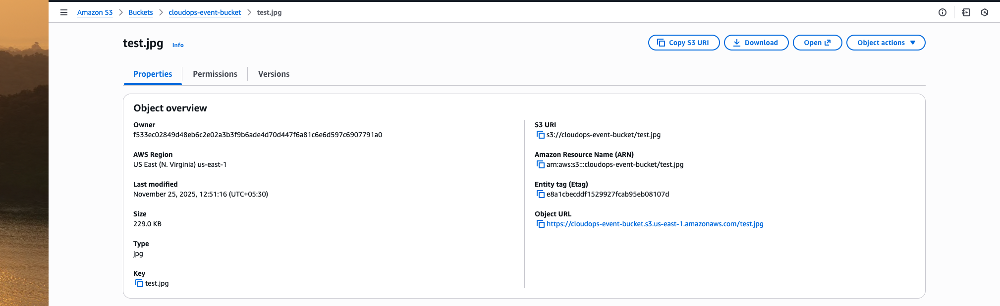
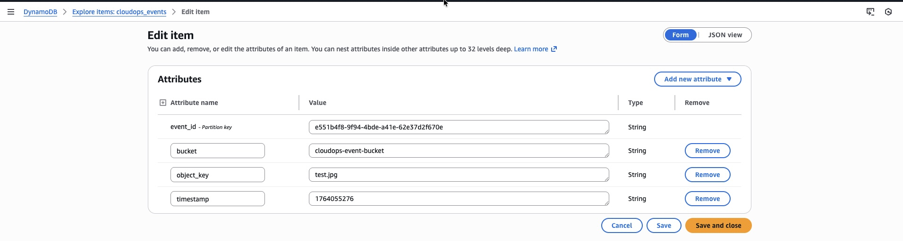

<html lang="en">
<head>
  <meta charset="utf-8" />
</head>
<body>

<h1>🟩 PHASE 1 – Cloud Foundation Setup (README.md)</h1>

This phase establishes the foundational AWS Identity and Access Management (IAM) setup and configures the AWS CLI to enable secure programmatic access for your CloudOps Automation project.

<h2>🧠 1. Create IAM User</h2>

<h3>Step 1: Access IAM Console</h3>
<ol>
  <li>Navigate to AWS Console → IAM</li>
  <li>Click Users → Add users</li>
</ol>

<h3>Step 2: Configure User Details</h3>
<ul>
  <li>User name: <strong>cloudops-admin</strong></li>
  <li>Access type: ✔ Programmatic access</li>
  <li>Console access: ✖ Leave unchecked</li>
</ul>

<h3>Step 3: Set Permissions</h3>
<ul>
  <li>Choose: Attach existing policies directly</li>
  <li>Select policy: <strong>AdministratorAccess</strong></li>
</ul>

<h3>Step 4: Add Tags (Optional)</h3>
<table border="1" cellpadding="4" cellspacing="0">
  <tr><th>Key</th><th>Value</th></tr>
  <tr><td>Project</td><td>CloudOpsAutomation</td></tr>
</table>

<h3>Step 5: Create Access Keys</h3>
<ol>
  <li>Open Security credentials tab</li>
  <li>Click <strong>Create access key</strong></li>
  <li>Choose CLI as use case</li>
  <li>Save Access Key ID + Secret Access Key</li>
</ol>

<h2>⚙️ 2. Configure AWS CLI</h2>

<h3>Step 1: Install AWS CLI (macOS)</h3>
<pre>
brew install awscli
aws --version
</pre>

<h3>Step 2: Configure Credentials</h3>
<pre>
aws configure
AWS Access Key ID: &lt;your-access-key-id&gt;
AWS Secret Access Key: &lt;your-secret-access-key&gt;
Default region: us-east-1
Output format: json
</pre>

Saved in:

<ul>
  <li>~/.aws/credentials</li>
  <li>~/.aws/config</li>
</ul>

<h3>Step 3: Verify Configuration</h3>
<pre>
aws sts get-caller-identity
</pre>

Expected:

<pre>
{
  "UserId": "AIDXXXXXXXXXXXX",
  "Account": "123456789012",
  "Arn": "arn:aws:iam::123456789012:user/cloudops-admin"
}
</pre>

<h2>🔐 3. Create Lambda Execution Role</h2>

<h3>Step 1: Create Trust Policy File</h3>

trust-policy.json:

<pre>
{
  "Version": "2012-10-17",
  "Statement": [
    {
      "Effect": "Allow",
      "Principal": { "Service": "lambda.amazonaws.com" },
      "Action": "sts:AssumeRole"
    }
  ]
}
</pre>

<h3>Step 2: Create the Role</h3>
<pre>
aws iam create-role --role-name CloudOpsLambdaRole \
--assume-role-policy-document file://trust-policy.json
</pre>

<h3>Step 3: Attach Execution Policy</h3>
<pre>
aws iam attach-role-policy --role-name CloudOpsLambdaRole \
--policy-arn arn:aws:iam::aws:policy/service-role/AWSLambdaBasicExecutionRole
</pre>

<h3>Step 4: Verify Role</h3>
<pre>
aws iam list-attached-role-policies --role-name CloudOpsLambdaRole
</pre>

Expected:

<pre>
{
  "AttachedPolicies": [
    {
      "PolicyName": "AWSLambdaBasicExecutionRole",
      "PolicyArn": "arn:aws:iam::aws:policy/service-role/AWSLambdaBasicExecutionRole"
    }
  ]
}
</pre>

<h3>Step 5: Console Verification</h3>

IAM → Roles → <strong>CloudOpsLambdaRole</strong>

<h2>🪣 4. Create S3 Bucket (AWS Console)</h2>
<ol>
  <li>Go to S3 → Create bucket</li>
  <li>Bucket name: <strong>cloudops-event-bucket</strong></li>
  <li>Region: us-east-1</li>
  <li>Block public access: Enabled</li>
  <li>Encryption: AES-256</li>
  <li>Create bucket</li>
</ol>

<strong>S3 Bucket Screenshot:</strong>

<h2>🔶 5. Create DynamoDB Table (cloudops_events)</h2>
<ol>
  <li>Go to DynamoDB → Tables → Create table</li>
  <li>Table name: <strong>cloudops_events</strong></li>
  <li>Partition key: event_id (String)</li>
  <li>Settings: Default</li>
  <li>Create table</li>
</ol>

<strong>DynamoDB Table Screenshot:</strong>

<h2>📬 6. Create SQS Queue (cloudops-job-queue)</h2>
<ol>
  <li>Go to SQS → Create queue</li>
  <li>Queue type: Standard</li>
  <li>Queue name: <strong>cloudops-job-queue</strong></li>
  <li>Create queue</li>
</ol>

<h2>📢 7. Create SNS Topic (cloudops-alerts)</h2>
<ol>
  <li>Go to SNS → Topics → Create topic</li>
  <li>Type: Standard</li>
  <li>Topic name: <strong>cloudops-alerts</strong></li>
  <li>Create topic</li>
  <li>(Optional) Create email subscription → Confirm email</li>
</ol>

<h2>📊 8. Enable CloudWatch Logs + Metrics</h2>

CloudWatch is auto-enabled. Verify:

<strong>Metrics</strong>

<ul>
  <li>AWS/S3</li>
  <li>AWS/SQS</li>
  <li>AWS/DynamoDB</li>
  <li>AWS/SNS</li>
  <li>AWS/Lambda</li>
</ul>

<strong>Logs</strong>

CloudWatch → Logs → Log groups

(Logs appear after Phase 2 Lambda runs.)

<h2>🐳 9. Install Local DevOps Tools</h2>

<h3>1. Install Docker Desktop</h3>

Download: https://docs.docker.com/desktop/install/mac/

<pre>docker --version</pre>

<h3>2. Install kubectl</h3>
<pre>
brew install kubectl
kubectl version --client
</pre>

<h3>3. Install Python</h3>
<pre>python3 --version</pre>

<h3>4. Install boto3</h3>
<pre>
pip install boto3

python3 - <<EOF
import boto3
print("boto3 working:", boto3.__version__)
EOF
</pre>

<h3>5. Install Git</h3>
<pre>git --version</pre>

<h3>6. Install Node.js (Optional)</h3>
<pre>node -v</pre>

<h2>🟨 Verification Summary (Step 9 Tools Check)</h2>

Run:

<pre>
docker --version
kubectl version --client
minikube version
python3 --version
pip show boto3
git --version
</pre>

If all work → Step 9 complete.

<h2>🔗 10. Verify Connectivity AWS ↔ CLI</h2>
<pre>
aws s3 ls
aws dynamodb list-tables
aws sqs list-queues
aws sns list-topics
</pre>

If resources appear:

<ul>
  <li>✔ Local machine connected to AWS</li>
  <li>✔ AWS CLI working</li>
  <li>✔ IAM user authentication confirmed</li>
</ul>

<h2>🎉 PHASE 1 Completed Successfully</h2>

You have completed:

<ul>
  <li>✔ IAM user</li>
  <li>✔ IAM role</li>
  <li>✔ AWS CLI</li>
  <li>✔ S3 bucket</li>
  <li>✔ DynamoDB table</li>
  <li>✔ SQS queue</li>
  <li>✔ SNS topic</li>
  <li>✔ CloudWatch</li>
  <li>✔ Local DevOps tools</li>
  <li>✔ AWS ↔ CLI connectivity</li>
</ul>

You are now ready for <strong>PHASE 2 — Lambda Automation 🚀</strong>

</body>
</html>
