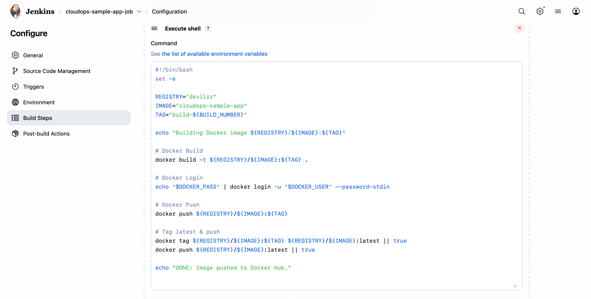
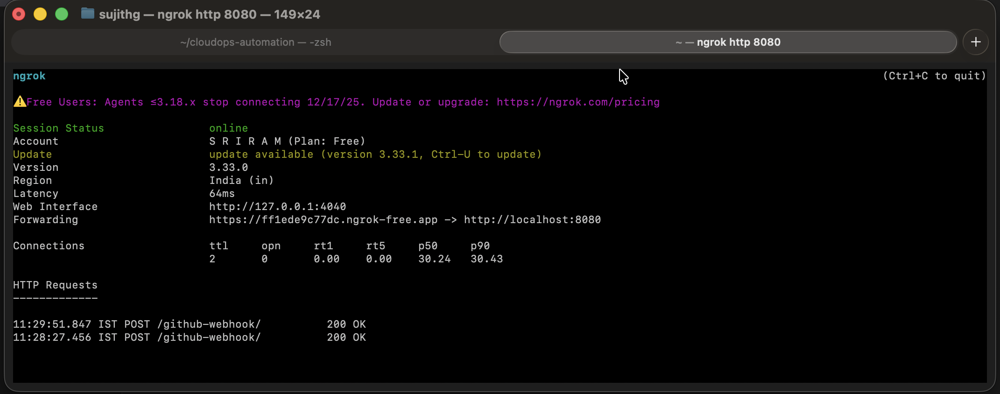
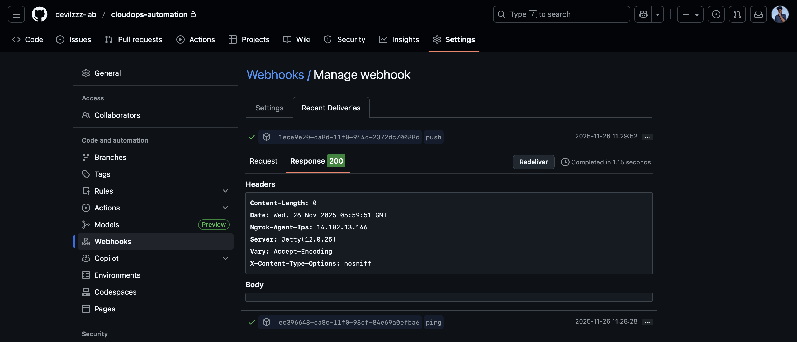
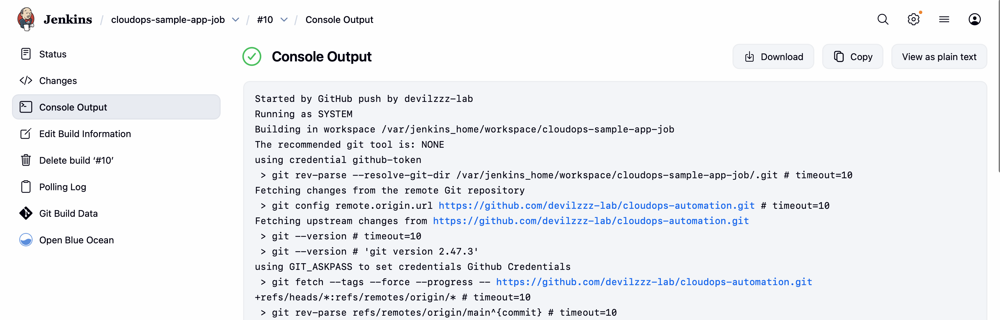
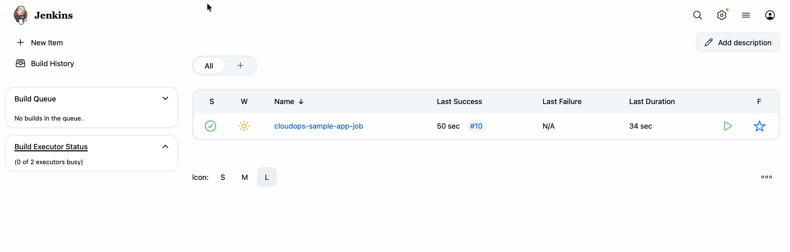

<!DOCTYPE html>
<html lang="en">
<head>
  <meta charset="utf-8">
  <meta name="viewport" content="width=device-width, initial-scale=1.0">
</head>
<body>

<h1>🟩 PHASE-3 CloudOps Automation: CI Build Pipeline (Jenkins + GitHub + Docker) (README.md)</h1>

<strong>Version:</strong> Phase 3 
<strong>Module:</strong> CI/CD &amp; Container Build Automation 
<strong>Project:</strong> CloudOps Automation, CI/CD &amp; Monitoring System

<h2>📌 1. Overview</h2>

Phase-3 focuses on building a Continuous Integration (CI) pipeline that automates Docker image builds and pushes to Docker Hub using:

<ul>
  <li>Jenkins (CI Orchestrator)</li>
  <li>GitHub (Source Repository)</li>
  <li>Docker (Containerization)</li>
  <li>Docker Hub (Container Registry)</li>
  <li>Webhooks (Trigger Builds Automatically)</li>
</ul>

This pipeline ensures:

<ul>
  <li>✔ Every GitHub commit triggers Jenkins automatically</li>
  <li>✔ Jenkins checks out source code</li>
  <li>✔ Jenkins builds Docker images with unique tags</li>
  <li>✔ Jenkins pushes images to Docker Hub</li>
  <li>✔ Full build → containerize → push sequence (CI only)</li>
</ul>

<strong>Note:</strong> Deployment to Kubernetes will be covered in Phase-4.

<h2>🧩 2. Architecture Diagram</h2>

<pre>
Developer (Local Machine)
        |
        |  git push
        v
  GitHub Repository
        |
        |  Webhook (push event)
        v
      Jenkins
  ---------------------------------
  | Checkout | Docker Build | Push |
  ---------------------------------
        |
        v
    Docker Hub
        |
        | (Ready for Phase-4 Deployment)
        v
    Kubernetes (Phase-4)
</pre>

<h2>🏗 3. Jenkins Setup (Docker-Based Installation)</h2>

<h3>3.1 Prerequisites</h3>

Ensure Docker is installed and running:

<pre>
docker --version
docker ps
</pre>

<h3>3.2 Create Jenkins Home Directory</h3>
<pre>
mkdir -p ~/jenkins_home
chmod 700 ~/jenkins_home
</pre>

<h3>3.3 Run Jenkins Container</h3>
<pre>
docker run -d \
  --name jenkins \
  --user root \
  --restart=unless-stopped \
  -p 8080:8080 \
  -p 50000:50000 \
  -v /var/run/docker.sock:/var/run/docker.sock \
  -v ~/jenkins_home:/var/jenkins_home \
  --network bridge \
  jenkins/jenkins:lts
</pre>

<strong>What each flag does:</strong>

<table border="1">
  <tr>
    <th>Flag</th>
    <th>Purpose</th>
  </tr>
  <tr>
    <td><code>--user root</code></td>
    <td>Runs Jenkins as root (required for Docker socket access on macOS)</td>
  </tr>
  <tr>
    <td><code>-p 8080:8080</code></td>
    <td>Exposes Jenkins web UI</td>
  </tr>
  <tr>
    <td><code>-v /var/run/docker.sock</code></td>
    <td>Mounts Docker socket for Docker CLI access</td>
  </tr>
  <tr>
    <td><code>-v ~/jenkins_home</code></td>
    <td>Persists Jenkins data and configuration</td>
  </tr>
</table>

<h3>3.4 Install Docker CLI Inside Jenkins</h3>

Enter Jenkins container:

<pre>
docker exec -u root -it jenkins bash
</pre>

Inside container, install Docker CLI:

<pre>
apt-get update
apt-get install -y docker.io curl
docker --version
</pre>

Exit container:

<pre>
exit
</pre>

<h3>3.5 Unlock Jenkins</h3>

Get initial admin password:

<pre>
docker exec -it jenkins cat /var/jenkins_home/secrets/initialAdminPassword
</pre>

Open Jenkins in browser:

<pre>
http://localhost:8080
</pre>

Enter the password and click <strong>Install Suggested Plugins</strong>.

<strong>Jenkins Environment Screenshot:</strong>

<h2>🔌 4. Required Plugins</h2>

After initial setup, verify these plugins are installed (Manage Jenkins → Plugins):

<ul>
  <li>Git</li>
  <li>GitHub Integration</li>
  <li>GitHub Branch Source</li>
  <li>Credentials</li>
  <li>Credentials Binding</li>
  <li>Pipeline (optional for future)</li>
</ul>

<h2>🔑 5. Configure Jenkins Credentials</h2>

<h3>5.1 GitHub Token (for private repo)</h3>

Navigate: <strong>Manage Jenkins → Credentials → System → Global credentials → Add Credentials</strong>

<table border="1">
  <tr>
    <th>Field</th>
    <th>Value</th>
  </tr>
  <tr>
    <td>Kind</td>
    <td>Secret text</td>
  </tr>
  <tr>
    <td>Scope</td>
    <td>Global</td>
  </tr>
  <tr>
    <td>Secret</td>
    <td>Your GitHub Personal Access Token</td>
  </tr>
  <tr>
    <td>ID</td>
    <td><strong>github-token</strong></td>
  </tr>
  <tr>
    <td>Description</td>
    <td>GitHub Access Token</td>
  </tr>
</table>

<h3>5.2 Docker Hub Credentials</h3>

Navigate: <strong>Manage Jenkins → Credentials → System → Global credentials → Add Credentials</strong>

<table border="1">
  <tr>
    <th>Field</th>
    <th>Value</th>
  </tr>
  <tr>
    <td>Kind</td>
    <td>Username with password</td>
  </tr>
  <tr>
    <td>Scope</td>
    <td>Global</td>
  </tr>
  <tr>
    <td>Username</td>
    <td>Your Docker Hub Username (e.g., devilzz)</td>
  </tr>
  <tr>
    <td>Password</td>
    <td>Your Docker Hub Password or Access Token</td>
  </tr>
  <tr>
    <td>ID</td>
    <td><strong>dockerhub-creds</strong></td>
  </tr>
  <tr>
    <td>Description</td>
    <td>Docker Hub Credentials</td>
  </tr>
</table>

<h2>🐳 6. Project Repository Setup</h2>

Your GitHub repository structure should look like this:

<pre>
cloudops-automation/
 ├── app.py
 ├── requirements.txt
 ├── Dockerfile
 ├── README.md
 ├── .dockerignore
 └── k8s/   (for Phase-4)
</pre>

<strong>Sample app.py:</strong>

<pre>
from flask import Flask
import os

app = Flask(__name__)

@app.route('/')
def hello():
    return f"&lt;h1&gt;CloudOps Sample App&lt;/h1&gt;&lt;p&gt;Build: {os.getenv('BUILD_NUMBER', 'local')}&lt;/p&gt;"

@app.route('/health')
def health():
    return {"status": "healthy"}, 200

if __name__ == '__main__':
    app.run(host='0.0.0.0', port=8080)
</pre>

<strong>requirements.txt:</strong>

<pre>
Flask==3.0.0
</pre>

<strong>Dockerfile:</strong>

<pre>
FROM python:3.10-slim
WORKDIR /app
COPY requirements.txt .
RUN pip install --no-cache-dir -r requirements.txt
COPY . .
EXPOSE 8080
CMD ["python", "app.py"]
</pre>

<h2>🟦 7. Create Jenkins CI Build Job</h2>

<h3>7.1 Create New Job</h3>
<ol>
  <li>Go to Jenkins Dashboard</li>
  <li>Click <strong>New Item</strong></li>
  <li>Enter name: <strong>cloudops-ci-build</strong></li>
  <li>Select <strong>Freestyle project</strong></li>
  <li>Click <strong>OK</strong></li>
</ol>

<h3>7.2 Configure Source Code Management</h3>

In the job configuration page:

<strong>Source Code Management → Git:</strong>

<table border="1">
  <tr>
    <th>Field</th>
    <th>Value</th>
  </tr>
  <tr>
    <td>Repository URL</td>
    <td><code>https://github.com/&lt;your-username&gt;/cloudops-automation.git</code></td>
  </tr>
  <tr>
    <td>Credentials</td>
    <td>Select <strong>github-token</strong></td>
  </tr>
  <tr>
    <td>Branch Specifier</td>
    <td><code>*/main</code></td>
  </tr>
</table>

<h3>7.3 Configure Build Triggers</h3>

Enable:

<ul>
  <li>☑ <strong>GitHub hook trigger for GITScm polling</strong></li>
</ul>

<h3>7.4 Configure Build Environment</h3>

Enable:

<ul>
  <li>☑ <strong>Use secret text(s) or file(s)</strong></li>
</ul>

Add binding:

<table border="1">
  <tr>
    <th>Field</th>
    <th>Value</th>
  </tr>
  <tr>
    <td>Binding Type</td>
    <td>Username and password (separated)</td>
  </tr>
  <tr>
    <td>Username Variable</td>
    <td><code>DOCKER_USER</code></td>
  </tr>
  <tr>
    <td>Password Variable</td>
    <td><code>DOCKER_PASS</code></td>
  </tr>
  <tr>
    <td>Credentials</td>
    <td>Select <strong>dockerhub-creds</strong></td>
  </tr>
</table>

<h3>7.5 Add Build Step (Execute Shell)</h3>

Click <strong>Add build step → Execute shell</strong> and paste:

<pre>
#!/bin/bash
set -e

REGISTRY="devilzz"
IMAGE="cloudops-sample-app"
TAG="build-${BUILD_NUMBER}"
FULL_IMAGE="${REGISTRY}/${IMAGE}"

echo "===================================="
echo "🔨 CI JOB – Docker Build & Push"
echo "Image: ${FULL_IMAGE}:${TAG}"
echo "===================================="

# Docker Login
echo "🔐 Logging into Docker Hub..."
echo "$DOCKER_PASS" | docker login -u "$DOCKER_USER" --password-stdin

# Docker Build
echo "🐳 Building image..."
docker build -t ${FULL_IMAGE}:${TAG} .

# Tag as latest
docker tag ${FULL_IMAGE}:${TAG} ${FULL_IMAGE}:latest

# Push images
echo "📤 Pushing images..."
docker push ${FULL_IMAGE}:${TAG}
docker push ${FULL_IMAGE}:latest

echo "✅ CI Build completed successfully"
echo "📦 Image: ${FULL_IMAGE}:${TAG}"
echo "📦 Image: ${FULL_IMAGE}:latest"
</pre>

<strong>Replace <code>devilzz</code> with your Docker Hub username!</strong>

<h3>7.6 Save the Job</h3>

Click <strong>Save</strong> at the bottom.

<strong>Execute Shell Screenshot:</strong>

<h2>🌐 8. Configure GitHub Webhook (Auto Trigger)</h2>

<h3>8.1 Expose Jenkins Locally (Using ngrok)</h3>

If Jenkins is running on your local machine, use ngrok to expose it:

<pre>
ngrok http 8080
</pre>

Copy the public URL (example):

<pre>
https://abc123.ngrok.io
</pre>

<strong>ngrok Public URL Screenshot:</strong>

<h3>8.2 Add Webhook in GitHub</h3>
<ol>
  <li>Go to your GitHub repository</li>
  <li>Click <strong>Settings → Webhooks → Add webhook</strong></li>
</ol>

<table border="1">
  <tr>
    <th>Field</th>
    <th>Value</th>
  </tr>
  <tr>
    <td>Payload URL</td>
    <td><code>https://abc123.ngrok.io/github-webhook/</code></td>
  </tr>
  <tr>
    <td>Content type</td>
    <td><code>application/json</code></td>
  </tr>
  <tr>
    <td>Which events?</td>
    <td>Just the push event</td>
  </tr>
  <tr>
    <td>Active</td>
    <td>☑ Checked</td>
  </tr>
</table>

Click <strong>Add webhook</strong>.

<strong>Webhooks Success Screenshot:</strong>

After pushing code, webhook should show <strong>✓ 200 OK</strong>.

<h2>🚀 9. Verification Steps</h2>

<h3>Step 1: Test Manual Build</h3>
<ol>
  <li>Go to Jenkins Dashboard</li>
  <li>Click on <strong>cloudops-ci-build</strong></li>
  <li>Click <strong>Build Now</strong></li>
  <li>Check <strong>Console Output</strong> for logs</li>
</ol>

<strong>Console Output Screenshot:</strong>

<strong>Job Success Screenshot:</strong>

<h3>Step 2: Test Automatic Build (Git Push)</h3>

Make a change and push:

<pre>
git commit --allow-empty -m "Test CI pipeline"
git push origin main
</pre>

Jenkins should trigger automatically within seconds.

<h3>Step 3: Verify Docker Hub</h3>

Check your Docker Hub repository:

<pre>
https://hub.docker.com/r/devilzz/cloudops-sample-app/tags
</pre>

You should see:

<ul>
  <li><code>build-1</code>, <code>build-2</code>, etc.</li>
  <li><code>latest</code> tag</li>
</ul>

<h3>Step 4: Test the Image Locally</h3>
<pre>
docker pull devilzz/cloudops-sample-app:latest
docker run -p 9090:8080 devilzz/cloudops-sample-app:latest
</pre>

Open browser:

<pre>
http://localhost:9090
</pre>

You should see: <strong>"CloudOps Sample App"</strong>

<h2>🏁 10. Completion Checklist</h2>

<table border="1">
  <tr>
    <th>Step</th>
    <th>Status</th>
    <th>Verification</th>
  </tr>
  <tr>
    <td>Jenkins server running</td>
    <td>✅</td>
    <td><code>docker ps | grep jenkins</code></td>
  </tr>
  <tr>
    <td>Docker CLI installed in Jenkins</td>
    <td>✅</td>
    <td><code>docker exec jenkins docker --version</code></td>
  </tr>
  <tr>
    <td>Jenkins plugins installed</td>
    <td>✅</td>
    <td>Manage Jenkins → Plugins</td>
  </tr>
  <tr>
    <td>GitHub credentials configured</td>
    <td>✅</td>
    <td>Credentials page shows github-token</td>
  </tr>
  <tr>
    <td>Docker Hub credentials configured</td>
    <td>✅</td>
    <td>Credentials page shows dockerhub-creds</td>
  </tr>
  <tr>
    <td>CI build job created</td>
    <td>✅</td>
    <td>Job <strong>cloudops-ci-build</strong> visible</td>
  </tr>
  <tr>
    <td>GitHub webhook configured</td>
    <td>✅</td>
    <td>Webhook shows ✓ 200</td>
  </tr>
  <tr>
    <td>Manual build successful</td>
    <td>✅</td>
    <td>Build #1 shows success</td>
  </tr>
  <tr>
    <td>Automatic build on push works</td>
    <td>✅</td>
    <td>Build triggered after git push</td>
  </tr>
  <tr>
    <td>Docker images pushed to Hub</td>
    <td>✅</td>
    <td>Tags visible on Docker Hub</td>
  </tr>
  <tr>
    <td>Image runs locally</td>
    <td>✅</td>
    <td><code>docker run</code> works</td>
  </tr>
</table>

<h2>🎯 11. What's Next?</h2>

Phase-3 is complete! You now have a fully automated CI pipeline that:

<ul>
  <li>✅ Builds Docker images on every commit</li>
  <li>✅ Pushes images to Docker Hub with unique tags</li>
  <li>✅ Works automatically via GitHub webhooks</li>
</ul>

<strong>In Phase-4, you will:</strong>

<ul>
  <li>Create a Kubernetes cluster using KIND</li>
  <li>Deploy these Docker images to Kubernetes</li>
  <li>Create a <strong>cloudops-prod-deploy</strong> Jenkins job</li>
  <li>Automate deployment using kubectl</li>
</ul>

<h2>🎉 Phase-3 Complete</h2>

Your CI pipeline is fully automated &amp; operational. You now have a production-style build system exactly like real DevOps workflows.

<strong>Next:</strong> Move to <strong>Phase-4</strong> for Kubernetes deployment.

</body>
</html>
