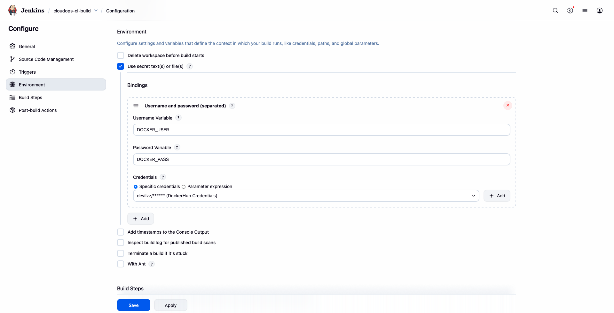
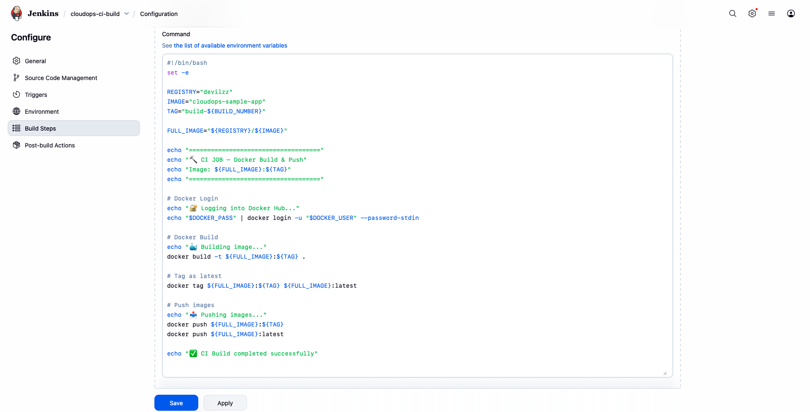
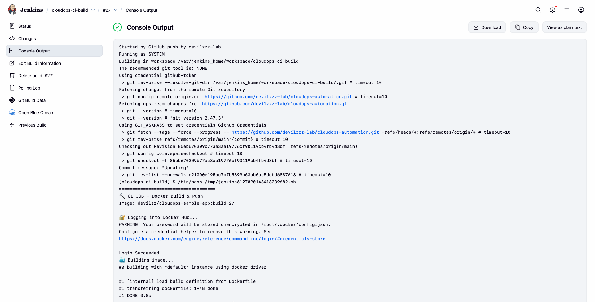
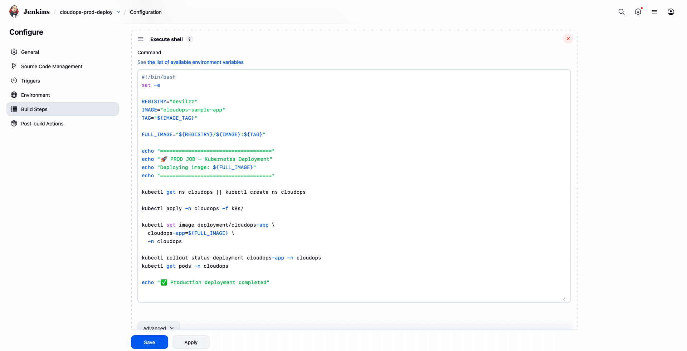
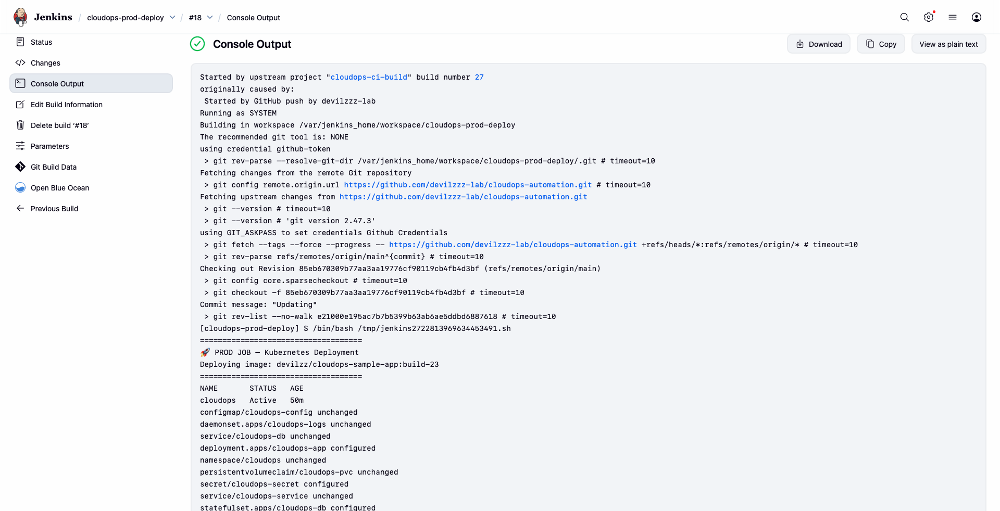

<!DOCTYPE html>
<html lang="en">
<head>
<meta charset="UTF-8">
<meta name="viewport" content="width=device-width, initial-scale=1.0">
</head>
<body>

<h1>🟧 PHASE-4: CI/CD Pipeline & Automation (README.md)</h1>

<strong>Version:</strong> Phase 4 
<strong>Module:</strong> CI/CD Jobs, Webhooks & Automated Deployment 
<strong>Project:</strong> CloudOps Automation, CI/CD &amp; Monitoring System

<h2>📌 1. Overview</h2>

Phase-4 focuses on creating a complete CI/CD automation pipeline using the environment set up in Phase-3.

This phase covers:

<ul>
<li>✔ Creating GitHub repository with application code</li>
<li>✔ Writing Kubernetes manifests</li>
<li>✔ Creating CI job for Docker build and push</li>
<li>✔ Creating CD job for Kubernetes deployment</li>
<li>✔ Setting up ngrok for webhook access</li>
<li>✔ Configuring GitHub webhooks</li>
<li>✔ Testing complete automation</li>
</ul>

<strong>Prerequisites:</strong> Phase-3 must be completed (Docker + KIND + Jenkins fully configured).

<h2>🧩 2. CI/CD Pipeline Architecture</h2>

<pre>
Developer (Local Machine)
        |
        | git push
        v
  GitHub Repository
        |
        | Webhook (via ngrok)
        v
      Jenkins
        |
        |-- Job 1: cloudops-ci-build
        |   ├── Checkout code
        |   ├── Build Docker image
        |   └── Push to Docker Hub
        |
        |-- Job 2: cloudops-prod-deploy
        |   ├── Apply K8s manifests
        |   ├── Wait for rollout
        |   └── Verify deployment
        |
        v
    Docker Hub
        |
        | Pull image
        v
  KIND Kubernetes Cluster
        |
        └── Running Application
</pre>

<h2>🐳 3. Project Repository Setup</h2>

<h3>Step 3.1: Create GitHub Repository</h3>

Create a new repository named: <code>cloudops-automation</code>

<h3>Step 3.2: Project Structure</h3>
<pre>
cloudops-automation/
├── k8s/
│   ├── configmap.yaml
│   ├── daemonset-logs.yaml
│   ├── db-service.yaml
│   ├── deployment.yaml
│   ├── namespace.yaml
│   ├── pvc.yaml
│   ├── secret.yaml
│   ├── service.yaml
│   └── statefulset-db.yaml
├── screenshots/
│   └── phase4/
├── .dockerignore
├── app.py
├── Dockerfile
├── jen-kub-doc-setup.md
├── Jenkinsfile
├── LOG-COMMANDS.md
├── Phase-1.md
├── Phase-2.md
├── Phase-3.md
├── Phase-4.md
├── README.md
└── requirements.txt
</pre>

<h3>Step 3.3: Application Files</h3>

<strong>📄 app.py</strong> - Flask application code

<strong>📄 requirements.txt</strong> - Python dependencies

<strong>📄 Dockerfile</strong> - Container image definition

<strong>📄 .dockerignore</strong> - Files to exclude from Docker build

<strong>Note:</strong> Refer to these files in your repository for actual content.

<h3>Step 3.4: Create Kubernetes Manifests</h3>

Create the following files inside <code>k8s/</code> folder:

<ul>
<li><code>namespace.yaml</code> - Namespace for the application</li>
<li><code>configmap.yaml</code> - Configuration data</li>
<li><code>secret.yaml</code> - Sensitive data (passwords, tokens)</li>
<li><code>deployment.yaml</code> - Application deployment</li>
<li><code>service.yaml</code> - Service to expose the application</li>
<li><code>db-service.yaml</code> - Database service</li>
<li><code>statefulset-db.yaml</code> - StatefulSet for database</li>
<li><code>pvc.yaml</code> - Persistent Volume Claim</li>
<li><code>daemonset-logs.yaml</code> - DaemonSet for log collection</li>
</ul>

<strong>Note:</strong> Refer to the <code>k8s/</code> folder in your repository for actual manifest content.

<h3>Step 3.5: Commit and Push to GitHub</h3>
<pre>
git init
git add .
git commit -m "Initial commit with app and K8s manifests"
git branch -M main
git remote add origin https://github.com/&lt;your-username&gt;/cloudops-automation.git
git push -u origin main
</pre>

<h2>🟦 4. Create CI Build Job (cloudops-ci-build)</h2>

<h3>4.1 Create New Job</h3>
<ol>
<li>Go to Jenkins Dashboard</li>
<li>Click <strong>New Item</strong></li>
<li>Enter name: <strong>cloudops-ci-build</strong></li>
<li>Select <strong>Freestyle project</strong></li>
<li>Click <strong>OK</strong></li>
</ol>

<h3>4.2 Configure Source Code Management</h3>

<strong>Source Code Management → Git:</strong>

<table border="1">
<tr>
<th>Field</th>
<th>Value</th>
</tr>
<tr>
<td>Repository URL</td>
<td><code>https://github.com/&lt;your-username&gt;/cloudops-automation.git</code></td>
</tr>
<tr>
<td>Credentials</td>
<td>Select <strong>github-token</strong></td>
</tr>
<tr>
<td>Branch Specifier</td>
<td><code>*/main</code></td>
</tr>
</table>

<h3>4.3 Configure Build Triggers</h3>

Enable:

<ul>
<li>☑ <strong>GitHub hook trigger for GITScm polling</strong></li>
</ul>

<h3>4.4 Configure Build Environment</h3>

Enable:

<ul>
<li>☑ <strong>Use secret text(s) or file(s)</strong></li>
</ul>

Add binding:

<table border="1">
<tr>
<th>Field</th>
<th>Value</th>
</tr>
<tr>
<td>Binding Type</td>
<td>Username and password (separated)</td>
</tr>
<tr>
<td>Username Variable</td>
<td><code>DOCKER_USER</code></td>
</tr>
<tr>
<td>Password Variable</td>
<td><code>DOCKER_PASS</code></td>
</tr>
<tr>
<td>Credentials</td>
<td>Select <strong>dockerhub-creds</strong></td>
</tr>
</table>

<strong>Jenkins Build Environment Configuration:</strong>

<h3>4.5 Add Build Step (Execute Shell)</h3>

Click <strong>Add build step → Execute shell</strong> and paste:

<pre>
#!/bin/bash
set -e

REGISTRY="devilzz"
IMAGE="cloudops-sample-app"
TAG="build-${BUILD_NUMBER}"
FULL_IMAGE="${REGISTRY}/${IMAGE}"

echo "===================================="
echo "🔨 CI JOB – Docker Build & Push"
echo "Image: ${FULL_IMAGE}:${TAG}"
echo "===================================="

# Docker Login
echo "🔐 Logging into Docker Hub..."
echo "$DOCKER_PASS" | docker login -u "$DOCKER_USER" --password-stdin

# Docker Build
echo "🐳 Building image..."
docker build -t ${FULL_IMAGE}:${TAG} .

# Tag as latest
docker tag ${FULL_IMAGE}:${TAG} ${FULL_IMAGE}:latest

# Push images
echo "📤 Pushing images..."
docker push ${FULL_IMAGE}:${TAG}
docker push ${FULL_IMAGE}:latest

echo "✅ CI Build completed successfully"
echo "📦 Image: ${FULL_IMAGE}:${TAG}"
echo "📦 Image: ${FULL_IMAGE}:latest"
</pre>

<strong>Replace <code>devilzz</code> with your Docker Hub username!</strong>

<strong>Jenkins Execute Shell Configuration:</strong>

<h3>4.6 Save the Job</h3>

Click <strong>Save</strong>.

<strong>Jenkins Build Console Output:</strong>

<strong>Jenkins Build Job Success:</strong>

<h2>🟩 5. Create CD Deployment Job (cloudops-prod-deploy)</h2>

<h3>5.1 Create New Job</h3>
<ol>
<li>Go to Jenkins Dashboard</li>
<li>Click <strong>New Item</strong></li>
<li>Enter name: <strong>cloudops-prod-deploy</strong></li>
<li>Select <strong>Freestyle project</strong></li>
<li>Click <strong>OK</strong></li>
</ol>

<h3>5.2 Configure General Settings (Parameterized Build)</h3>

Enable:

<ul>
<li>☑ <strong>This project is parameterized</strong></li>
</ul>

Click <strong>Add Parameter → String Parameter</strong>

<table border="1">
<tr>
<th>Field</th>
<th>Value</th>
</tr>
<tr>
<td>Name</td>
<td><code>IMAGE_TAG</code></td>
</tr>
<tr>
<td>Default Value</td>
<td><code>build-23</code></td>
</tr>
<tr>
<td>Description</td>
<td>Docker image tag to deploy (e.g., build-23, latest)</td>
</tr>
</table>

<strong>Jenkins Prod Parameter Configuration:</strong>

<h3>5.3 Configure Source Code Management</h3>

<strong>Source Code Management → Git:</strong>

<table border="1">
<tr>
<th>Field</th>
<th>Value</th>
</tr>
<tr>
<td>Repository URL</td>
<td><code>https://github.com/&lt;your-username&gt;/cloudops-automation.git</code></td>
</tr>
<tr>
<td>Credentials</td>
<td>Select <strong>github-token</strong></td>
</tr>
<tr>
<td>Branch Specifier</td>
<td><code>*/main</code></td>
</tr>
</table>

<h3>5.4 Configure Build Triggers</h3>

Enable:

<ul>
<li>☑ <strong>Build after other projects are built</strong></li>
<li>Projects to watch: <code>cloudops-ci-build</code></li>
<li>Trigger only if build is stable</li>
</ul>

<h3>5.5 Add Build Step (Execute Shell)</h3>

Click <strong>Add build step → Execute shell</strong> and paste:

<pre>
#!/bin/bash
set -e

echo "===================================="
echo "🚀 CD JOB – Kubernetes Deployment"
echo "Image Tag: ${IMAGE_TAG}"
echo "===================================="

# Apply Kubernetes manifests
echo "📦 Applying Kubernetes manifests..."
kubectl apply -f k8s/

# Update deployment with specific image tag
echo "🔄 Updating deployment with image tag: ${IMAGE_TAG}"
kubectl set image deployment/cloudops-app cloudops-app=devilzz/cloudops-sample-app:${IMAGE_TAG} -n cloudops

# Wait for deployment rollout
echo "⏳ Waiting for deployment rollout..."
kubectl rollout status deployment/cloudops-app -n cloudops --timeout=300s

# Verify pods are running
echo "🔍 Checking pod status..."
kubectl get pods -n cloudops

# Get service details
echo "🌐 Service endpoint:"
kubectl get svc cloudops-service -n cloudops

echo "✅ Deployment completed successfully!"
echo "📍 Access app at: http://localhost:30080"
</pre>

<strong>Replace <code>devilzz</code> with your Docker Hub username!</strong>

<strong>Jenkins Prod Execute Shell Configuration:</strong>

<h3>5.6 Save the Job</h3>

Click <strong>Save</strong>.

<strong>Jenkins Prod Console Output:</strong>

<strong>Jenkins Prod Job Success:</strong>

<h2>🌐 6. Setup ngrok for Webhook Access</h2>

<h3>Step 6.1: Install ngrok</h3>

Download from: <code>https://ngrok.com/download</code>

Or install via Homebrew:

<pre>
brew install ngrok
</pre>

<h3>Step 6.2: Start ngrok</h3>
<pre>
ngrok http 8080
</pre>

<h3>Step 6.3: Copy Public URL</h3>

ngrok will display a public URL like:

<pre>
https://abc123.ngrok.io
</pre>

<strong>Keep this terminal window open!</strong>

<strong>ngrok Public URL:</strong>

<h2>🔗 7. Configure GitHub Webhook</h2>

<h3>Step 7.1: Go to GitHub Repository Settings</h3>
<ol>
<li>Open your <code>cloudops-automation</code> repository</li>
<li>Click <strong>Settings → Webhooks → Add webhook</strong></li>
</ol>

<h3>Step 7.2: Configure Webhook</h3>
<table border="1">
<tr>
<th>Field</th>
<th>Value</th>
</tr>
<tr>
<td>Payload URL</td>
<td><code>https://abc123.ngrok.io/github-webhook/</code></td>
</tr>
<tr>
<td>Content type</td>
<td><code>application/json</code></td>
</tr>
<tr>
<td>Which events?</td>
<td>Just the push event</td>
</tr>
<tr>
<td>Active</td>
<td>☑ Checked</td>
</tr>
</table>

Click <strong>Add webhook</strong>.

<h3>Step 7.3: Verify Webhook</h3>

After saving, webhook should show <strong>✓</strong> with a green checkmark.

<strong>GitHub Webhook Success:</strong>

<h2>🚀 8. Test CI/CD Pipeline</h2>

<h3>Test 1: Manual Build (CI Job)</h3>
<ol>
<li>Go to Jenkins → <strong>cloudops-ci-build</strong></li>
<li>Click <strong>Build Now</strong></li>
<li>Check Console Output</li>
<li>Verify build success</li>
<li><strong>cloudops-prod-deploy</strong> should trigger automatically</li>
</ol>

<h3>Test 2: Manual Deployment with Specific Image Tag</h3>
<ol>
<li>Go to Jenkins → <strong>cloudops-prod-deploy</strong></li>
<li>Click <strong>Build with Parameters</strong></li>
<li>Enter <code>IMAGE_TAG</code> value (e.g., <code>build-23</code> or <code>latest</code>)</li>
<li>Click <strong>Build</strong></li>
<li>Check Console Output</li>
</ol>

<h3>Test 3: Verify Deployment</h3>
<pre>
kubectl get all -n cloudops
</pre>

<strong>Expected output:</strong>

<pre>
NAME                               READY   STATUS    RESTARTS   AGE
pod/cloudops-app-xxxxxxxxxx-xxxxx  1/1     Running   0          XXs

NAME                       TYPE       CLUSTER-IP      EXTERNAL-IP   PORT(S)        AGE
service/cloudops-service   NodePort   10.XX.XXX.XXX   &lt;none&gt;        80:30080/TCP   XXs

NAME                           READY   UP-TO-DATE   AVAILABLE   AGE
deployment.apps/cloudops-app   3/3     3            3           XXs
</pre>

<h3>Test 4: Access Application</h3>

Open browser:

<pre>
http://localhost:30080
</pre>

<strong>Expected:</strong> You should see "CloudOps Sample App" with build number!

<h3>Test 5: Docker Image Build</h3>

<strong>Docker Image Build Success:</strong>

<h3>Test 6: Automatic Trigger (Git Push)</h3>

Make a change and push:

<pre>
echo "# CI/CD Test" &gt;&gt; README.md
git add .
git commit -m "Test automatic CI/CD"
git push origin main
</pre>

<strong>What happens:</strong>

<ol>
<li>GitHub sends webhook to Jenkins (via ngrok)</li>
<li><strong>cloudops-ci-build</strong> triggers automatically</li>
<li>Docker image built and pushed with tag <code>build-${BUILD_NUMBER}</code></li>
<li><strong>cloudops-prod-deploy</strong> triggers after CI success</li>
<li>Kubernetes updates pods with new image</li>
<li>Application updated automatically!</li>
</ol>

<h2>🏁 9. Completion Checklist</h2>

<table border="1">
<tr>
<th>Step</th>
<th>Status</th>
<th>Verification</th>
</tr>
<tr>
<td>GitHub repository created</td>
<td>✅</td>
<td>Repository visible on GitHub</td>
</tr>
<tr>
<td>Application code pushed</td>
<td>✅</td>
<td>Files visible in repository</td>
</tr>
<tr>
<td>K8s manifests created</td>
<td>✅</td>
<td><code>k8s/</code> folder exists with all YAML files</td>
</tr>
<tr>
<td>CI build job created</td>
<td>✅</td>
<td>Job <strong>cloudops-ci-build</strong> visible</td>
</tr>
<tr>
<td>CD deploy job created</td>
<td>✅</td>
<td>Job <strong>cloudops-prod-deploy</strong> visible</td>
</tr>
<tr>
<td>Parameterized build configured</td>
<td>✅</td>
<td><code>IMAGE_TAG</code> parameter available</td>
</tr>
<tr>
<td>ngrok running</td>
<td>✅</td>
<td>Public URL active</td>
</tr>
<tr>
<td>GitHub webhook configured</td>
<td>✅</td>
<td>Webhook shows ✓</td>
</tr>
<tr>
<td>Manual build works</td>
<td>✅</td>
<td>Build Now succeeds</td>
</tr>
<tr>
<td>Parameterized deployment works</td>
<td>✅</td>
<td>Build with Parameters succeeds</td>
</tr>
<tr>
<td>Auto deployment works</td>
<td>✅</td>
<td>CD job triggers after CI</td>
</tr>
<tr>
<td>Application accessible</td>
<td>✅</td>
<td><code>http://localhost:30080</code> works</td>
</tr>
<tr>
<td>Auto trigger on push works</td>
<td>✅</td>
<td>Git push triggers pipeline</td>
</tr>
</table>

<h2>🎉 10. Phase-4 Complete</h2>

Congratulations! You now have a complete CI/CD pipeline with:

<ul>
<li>✅ Automated Docker image builds on every commit</li>
<li>✅ Automated Kubernetes deployments</li>
<li>✅ Parameterized deployments for specific image tags</li>
<li>✅ GitHub webhook integration</li>
<li>✅ Zero-downtime rolling updates</li>
<li>✅ Production-ready DevOps workflow</li>
</ul>

<strong>Your complete workflow:</strong>

<pre>
Code Change → Git Push → GitHub Webhook → Jenkins CI → Docker Hub → Jenkins CD → Kubernetes → Live App
</pre>

<strong>Next Steps:</strong>

<ul>
<li>Add monitoring with Prometheus & Grafana</li>
<li>Implement autoscaling</li>
<li>Add ingress controller</li>
<li>Set up centralized logging</li>
<li>Add security scanning</li>
</ul>

<strong>— CloudOps Automation Project | Complete CI/CD Pipeline Ready 🚀</strong>

</body>
</html>
