<!DOCTYPE html>
<html lang="en">
<head>
  <meta charset="UTF-8">
  <meta name="viewport" content="width=device-width, initial-scale=1.0">
  <title>Phase 4 - Kubernetes Deployment on AWS EKS</title>
</head>
<body>

<h1>🟧 PHASE 4 – Kubernetes Deployment on AWS EKS</h1>

<strong>Version:</strong> Phase 4 
<strong>Module:</strong> Kubernetes Deployment &amp; EKS Orchestration 
<strong>Project:</strong> CloudOps Automation, CI/CD &amp; Monitoring System

This phase deploys your Dockerized CloudOps application to a managed Kubernetes cluster (Amazon EKS) and connects it with Jenkins using Execute Shell jobs for Dev / Test / Prod environments.

<h2>📌 1. Overview</h2>

In this phase, you will:

<ul>
  <li>✔ Create an EKS cluster using the AWS Console (web UI)</li>
  <li>✔ Use gp2/gp3 EBS for persistent storage</li>
  <li>✔ Define Kubernetes manifests in a /k8s folder</li>
  <li>✔ Configure kubectl to talk to the EKS cluster</li>
  <li>✔ Create three Jenkins Freestyle jobs (Dev / Test / Prod)</li>
  <li>✔ Each Jenkins job will:
    <ul>
      <li>Pull code from GitHub</li>
      <li>Build a Docker image</li>
      <li>Push image to Docker Hub</li>
      <li>Run <code>kubectl apply -f k8s/</code> to deploy to EKS</li>
    </ul>
  </li>
  <li>✔ Verify the application is reachable via EKS LoadBalancer / Ingress</li>
</ul>

<h2>🧩 2. Architecture Diagram</h2>

<pre>
Developer (Git Push)
        |
        v
------------------------------
        GitHub Repo
------------------------------
        |
        |  Webhook (push)
        v
------------------------------
            Jenkins
      [Freestyle Jobs]
  Dev / Test / Prod Deploy
  - Docker Build &amp; Push
  - kubectl apply -f k8s/
------------------------------
        |
        v
------------------------------
   Docker Hub (Registry)
------------------------------
        |
        v
------------------------------           ----------------------
         Amazon EKS Cluster               EBS Storage (gp2/gp3)
------------------------------           ----------------------
   | Namespace: cloudops           |
   | Deployment (App)              |
   | Service (LoadBalancer)        |
   | Ingress (Optional, ALB)       |
   | StatefulSet (DB, uses PVC)    |
   | DaemonSet (Logging Agent)     |
   | PV/PVC (gp2/gp3 EBS volumes)  |
------------------------------
</pre>

<h2>🛰 3. Create EKS Cluster (AWS Console – Web UI)</h2>

<h3>🧠 3.1 Create EKS Cluster (Control Plane)</h3>

<h4>Step 1: Navigate to EKS Console</h4>
<ol>
  <li>Go to AWS Console → Search "EKS" → Click <strong>Elastic Kubernetes Service</strong></li>
  <li>Click <strong>Add cluster</strong> → <strong>Create</strong></li>
</ol>

<h4>Step 2: Configure Cluster - Choose Custom Configuration</h4>

<strong>⚠️ Important:</strong> Do NOT select "Quick configuration (with EKS Auto Mode)"

<ul>
  <li>Select <strong>Custom configuration</strong></li>
  <li>EKS Auto Mode: <strong>Disabled</strong> (toggle OFF)</li>
</ul>

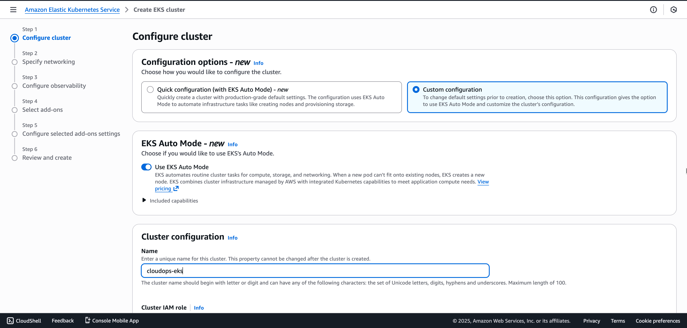

<h4>Step 3: Cluster Configuration</h4>

<strong>Cluster Name:</strong>

<ul>
  <li>Name: <code>cloudops-eks</code></li>
</ul>

<strong>Cluster IAM Role:</strong>

<ul>
  <li>If you don't have an existing role, click <strong>Create recommended role</strong></li>
  <li>This will open a new tab to create IAM role with <code>AmazonEKSClusterPolicy</code></li>
  <li>Give role name: <code>cloudops-eks-cluster-role</code></li>
  <li>Return to EKS console and select the newly created role</li>
</ul>

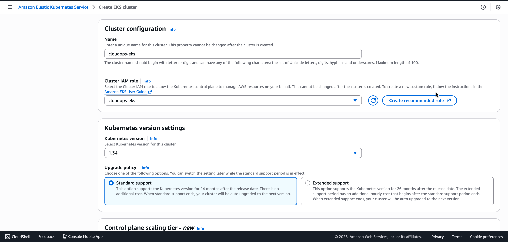

<h4>Step 4: Kubernetes Version Settings</h4>

<strong>Kubernetes version:</strong>

<ul>
  <li>Select: <strong>1.34</strong> (or latest available)</li>
</ul>

<strong>Upgrade policy:</strong>

<ul>
  <li>Select: <strong>Standard support</strong> (NOT extended support)</li>
</ul>

<strong>Control Plane Scaling tier:</strong>

<ul>
  <li>Leave default (Standard)</li>
</ul>

<h4>Step 5: Cluster Access</h4>

<strong>Bootstrap cluster administrator access:</strong>

<ul>
  <li>Select: <strong>Allow cluster administrator access</strong></li>
</ul>

<strong>Cluster authentication mode:</strong>

<ul>
  <li>Select: <strong>EKS API and ConfigMap</strong></li>
</ul>

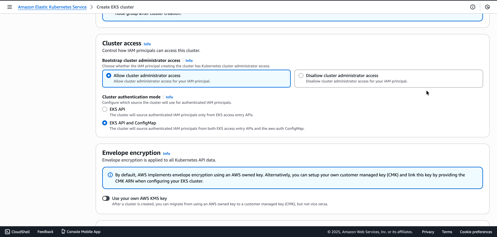

<h4>Step 6: Envelope Encryption</h4>

<strong>Envelope encryption:</strong>

<ul>
  <li>Do NOT enable "Use your own AWS KMS key"</li>
  <li>Let AWS use its own managed key (default)</li>
</ul>

Click <strong>Next</strong> to proceed to Networking

<h4>Step 7: Specify Networking</h4>

<strong>VPC:</strong>

<ul>
  <li>Select your <strong>Default VPC</strong></li>
  <li>⚠️ Do NOT use launch-wizard VPC</li>
</ul>

<strong>Subnets:</strong>

<ul>
  <li>AWS will auto-select subnets from your VPC</li>
  <li>Ensure at least <strong>2 subnets</strong> from different Availability Zones are selected</li>
</ul>

<strong>Security groups:</strong>

<ul>
  <li>Select <strong>Default VPC Security Group</strong></li>
</ul>

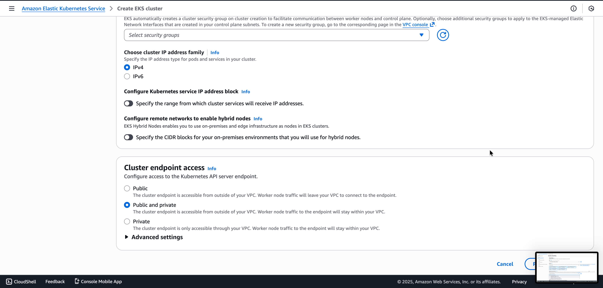

<h4>Step 8: Cluster IP Address Settings</h4>

<strong>Choose cluster IP address family:</strong>

<ul>
  <li>Select: <strong>IPv4</strong></li>
</ul>

<strong>Configure Kubernetes service IP address block:</strong>

<ul>
  <li><strong>Disabled</strong> (leave unchecked)</li>
</ul>

<strong>Configure remote networks to enable hybrid nodes:</strong>

<ul>
  <li><strong>Disabled</strong> (leave unchecked)</li>
</ul>

<h4>Step 9: Cluster Endpoint Access</h4>

<strong>API server endpoint access:</strong>

<ul>
  <li>Select: <strong>Public and private</strong></li>
  <li>This allows access from both inside VPC and external (your Mac, Jenkins)</li>
</ul>

<strong>Public access source allowlist:</strong>

<ul>
  <li>Default: <code>0.0.0.0/0</code> (allow from anywhere)</li>
</ul>

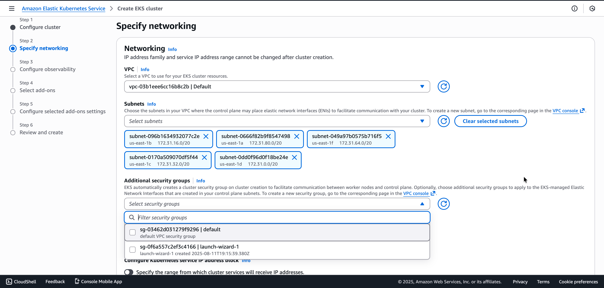

Click <strong>Next</strong> to proceed to Observability

<h4>Step 10: Configure Observability</h4>

<strong>⚠️ Disable all observability features to save costs:</strong>

<strong>Metrics:</strong>

<ul>
  <li>Prometheus: <strong>Unchecked</strong></li>
  <li>CloudWatch: <strong>Unchecked</strong></li>
</ul>

<strong>Container network observability:</strong>

<ul>
  <li>Enable network monitoring: <strong>Unchecked</strong></li>
</ul>

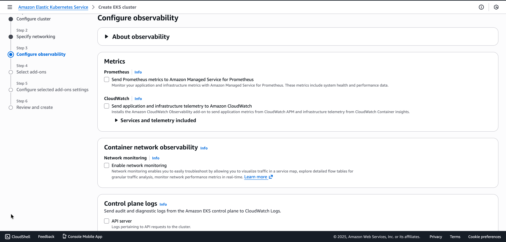

<h4>Step 11: Control Plane Logs</h4>

<strong>⚠️ Disable all control plane logging to save costs:</strong>

<ul>
  <li>API server: <strong>Unchecked</strong></li>
  <li>Audit: <strong>Unchecked</strong></li>
  <li>Authenticator: <strong>Unchecked</strong></li>
  <li>Controller manager: <strong>Unchecked</strong></li>
  <li>Scheduler: <strong>Unchecked</strong></li>
</ul>

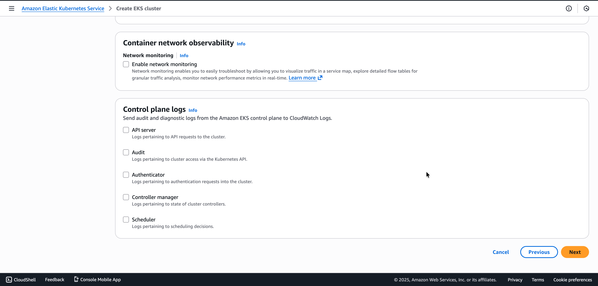

Click <strong>Next</strong> to proceed to Add-ons

<h4>Step 12: Select Add-ons</h4>

<strong>✅ Keep these 4 default add-ons selected:</strong>

<ul>
  <li>✅ <strong>CoreDNS</strong> - Enable service discovery within your cluster</li>
  <li>✅ <strong>kube-proxy</strong> - Enable service networking within your cluster</li>
  <li>✅ <strong>Amazon VPC CNI</strong> - Enable pod networking within your cluster</li>
  <li>✅ <strong>eks-node-monitoring-agent</strong> - Enable automatic detection of node health issues</li>
</ul>

<strong>❌ Uncheck/Remove these add-ons:</strong>

<ul>
  <li>❌ External DNS (if selected)</li>
  <li>❌ Metrics Server (if selected)</li>
  <li>❌ Pod Identity Agent (if selected)</li>
  <li>❌ Amazon SageMaker Spaces (if shown)</li>
  <li>❌ CSI Snapshot Controller (if shown)</li>
</ul>

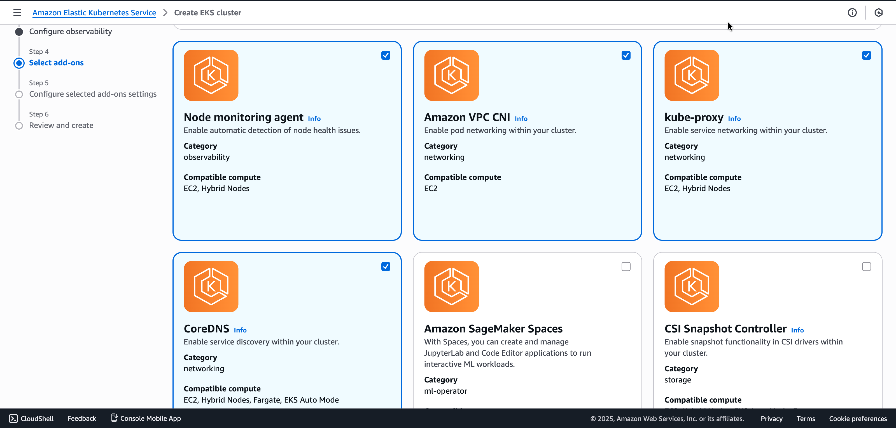

Click <strong>Next</strong> to proceed to Versions

<h4>Step 13: Configure Add-on Versions</h4>

<strong>Selected add-ons version:</strong>

<ul>
  <li>coredns: <code>v1.12.3-eksbuild.1</code> (or latest)</li>
  <li>eks-node-monitoring-agent: <code>v1.4.2-eksbuild.1</code> (or latest)</li>
  <li>kube-proxy: <code>v1.34.0-eksbuild.2</code> (or latest)</li>
  <li>vpc-cni: <code>v1.20.4-eksbuild.2</code> (or latest)</li>
</ul>

<strong>EKS Pod Identity:</strong>

<ul>
  <li>vpc-cni: Service account = <code>aws-node</code></li>
  <li>IAM role: Not set (default)</li>
</ul>

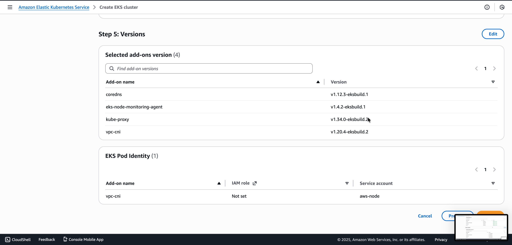

Click <strong>Next</strong> to proceed to Review

<h4>Step 14: Review and Create</h4>

<strong>Review all settings:</strong>

<strong>Step 1: Cluster Configuration</strong>

<ul>
  <li>Name: <code>cloudops-eks</code></li>
  <li>Kubernetes version: <code>1.34</code></li>
  <li>EKS Auto Mode: Disabled</li>
  <li>Cluster IAM role: <code>arn:aws:iam::784154679353:role/cloudops-eks</code></li>
  <li>Authentication mode: EKS API and ConfigMap</li>
  <li>Upgrade policy: Standard support</li>
  <li>Control plane scaling tier: Standard</li>
  <li>Kubernetes cluster administrator access: Allow cluster administrator access</li>
</ul>

<strong>Step 2: Networking</strong>

<ul>
  <li>VPC: <code>vpc-03b1eee6cc16b8c2b</code></li>
  <li>Subnets: 5 subnets selected across multiple AZs</li>
  <li>Security groups: <code>sg-03462d031279f9296</code></li>
  <li>Cluster IP address family: IPv4</li>
  <li>API server endpoint access: Public and private</li>
  <li>Public access source allowlist: <code>0.0.0.0/0</code></li>
</ul>

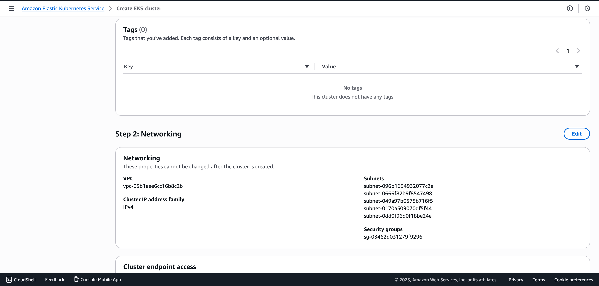

<strong>Step 3: Observability</strong>

<ul>
  <li>Network monitoring status: Disabled</li>
  <li>Control plane logs: All disabled (API server, Audit, Authenticator, Controller manager, Scheduler)</li>
</ul>

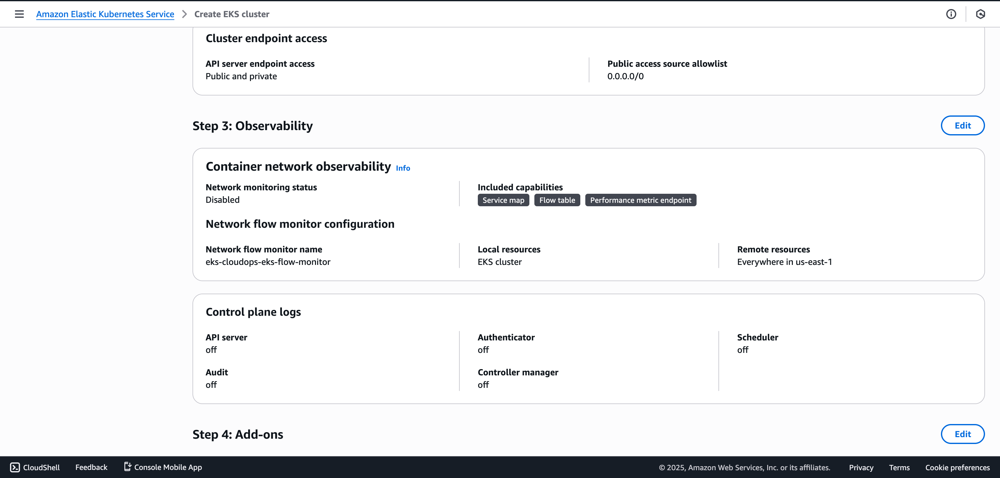

<strong>Step 4: Add-ons</strong>

<ul>
  <li>coredns (networking) - Ready to install</li>
  <li>eks-node-monitoring-agent (observability) - Ready to install</li>
  <li>kube-proxy (networking) - Ready to install</li>
  <li>vpc-cni (networking) - Ready to install</li>
</ul>

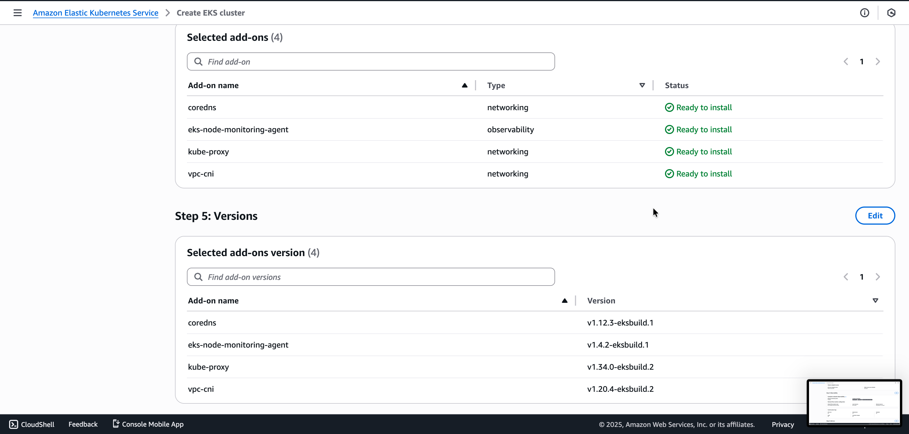

<strong>⏳ Click "Create" button and wait 10-15 minutes</strong>

<h4>Step 15: Verify Cluster Status - Active ✅</h4>

Once cluster creation completes, verify:

<ul>
  <li>Cluster status: <strong>Active</strong> (green checkmark)</li>
  <li>Kubernetes version: <code>1.34</code></li>
  <li>Provider: <code>EKS</code></li>
  <li>Support period: Standard support until December 2, 2026</li>
  <li>Cluster health: <code>0</code> issues</li>
  <li>Upgrade insights: <code>0</code></li>
  <li>Node health issues: <code>0</code></li>
  <li>Capability issues: <code>0</code></li>
</ul>

<strong>Details visible:</strong>

<ul>
  <li>API server endpoint: <code>https://FBD4C15CFA17E996A1AC5CA04B935F44.gr7.us-east-1.eks.amazonaws.com</code></li>
  <li>OpenID Connect provider URL: Generated</li>
  <li>Certificate authority: Displayed</li>
  <li>Cluster IAM role ARN: <code>arn:aws:iam::784154679353:role/cloudops-eks</code></li>
  <li>Cluster ARN: <code>arn:aws:eks:us-east-1:784154679353:cluster/cloudops-eks</code></li>
  <li>Platform version: <code>eks.9</code></li>
  <li>Created: 14 minutes ago</li>
</ul>

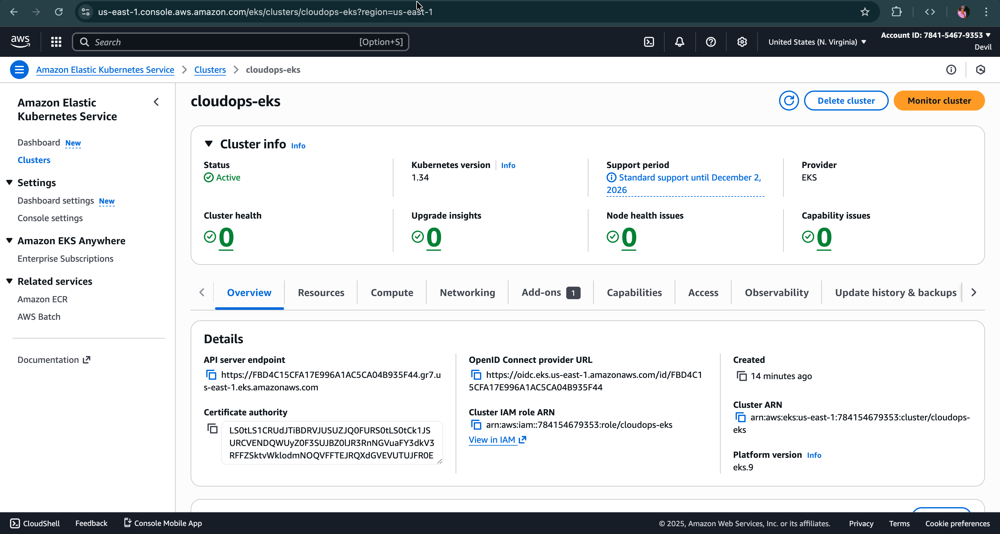

✅ <strong>EKS Cluster Control Plane Created Successfully!</strong>

<h3>🧠 3.2 Create Node Group (Worker Nodes)</h3>

<em>(To be continued in next section...)</em>

<h2>🧰 4. Kubernetes Manifests (k8s/ Folder)</h2>

In your repo (<code>cloudops-automation/</code>), create:

<pre>
cloudops-automation/
├── app.py
├── requirements.txt
├── Dockerfile
├── PHASE-1.md
├── PHASE-2.md
├── PHASE-3.md
├── PHASE-4.md
├── screenshots/
│   └── phase4/
│       ├── eks-01-configure-cluster.png
│       ├── eks-02-cluster-config.png
│       ├── eks-03-specify-networking.png
│       ├── eks-04-cluster-endpoint-access.png
│       ├── eks-05-cluster-access.png
│       ├── eks-06-observability.png
│       ├── eks-07-observability-logs.png
│       ├── eks-08-addons.png
│       ├── eks-09-review-create.png
│       ├── eks-10-review-networking.png
│       ├── eks-11-review-observability.png
│       ├── eks-12-review-addons.png
│       ├── eks-13-addons-versions.png
│       └── eks-14-cluster-active.png
└── k8s/
    ├── namespace.yaml
    ├── deployment.yaml
    ├── service.yaml
    ├── configmap.yaml
    ├── secret.yaml
    ├── storageclass-gp3.yaml
    ├── pvc.yaml
    ├── statefulset-db.yaml
    ├── daemonset-logs.yaml
    └── ingress.yaml (optional)
</pre>

<h3>🧾 4.1 Namespace</h3>

<pre><code># k8s/namespace.yaml
apiVersion: v1
kind: Namespace
metadata:
  name: cloudops
</code></pre>

<h3>🧾 4.2 ConfigMap</h3>

<pre><code># k8s/configmap.yaml
apiVersion: v1
kind: ConfigMap
metadata:
  name: cloudops-config
  namespace: cloudops
data:
  APP_ENV: "production"
  LOG_LEVEL: "info"
</code></pre>

<h3>🧾 4.3 Secret</h3>

<pre><code># k8s/secret.yaml
apiVersion: v1
kind: Secret
metadata:
  name: cloudops-secret
  namespace: cloudops
type: Opaque
stringData:
  DB_PASSWORD: "super-secret"
  API_KEY: "your-api-key"
</code></pre>

<h3>🧾 4.4 Deployment (Application)</h3>

<pre><code># k8s/deployment.yaml
apiVersion: apps/v1
kind: Deployment
metadata:
  name: cloudops-app
  namespace: cloudops
spec:
  replicas: 2
  selector:
    matchLabels:
      app: cloudops-app
  template:
    metadata:
      labels:
        app: cloudops-app
    spec:
      containers:
        - name: cloudops-app
          image: devilzz/cloudops-app:latest
          ports:
            - containerPort: 8080
          envFrom:
            - configMapRef:
                name: cloudops-config
            - secretRef:
                name: cloudops-secret
</code></pre>

<h3>🧾 4.5 Service (LoadBalancer)</h3>

<pre><code># k8s/service.yaml
apiVersion: v1
kind: Service
metadata:
  name: cloudops-service
  namespace: cloudops
spec:
  type: LoadBalancer
  selector:
    app: cloudops-app
  ports:
    - port: 80
      targetPort: 8080
      protocol: TCP
</code></pre>

This will create an AWS NLB/ELB with a public DNS hostname.

<h3>🧾 4.6 StorageClass (gp3)</h3>

<pre><code># k8s/storageclass-gp3.yaml
apiVersion: storage.k8s.io/v1
kind: StorageClass
metadata:
  name: gp3
provisioner: ebs.csi.aws.com
volumeBindingMode: WaitForFirstConsumer
parameters:
  type: gp3
</code></pre>

<h3>🧾 4.7 PVC (PersistentVolumeClaim)</h3>

<pre><code># k8s/pvc.yaml
apiVersion: v1
kind: PersistentVolumeClaim
metadata:
  name: cloudops-pvc
  namespace: cloudops
spec:
  accessModes:
    - ReadWriteOnce
  storageClassName: gp3
  resources:
    requests:
      storage: 5Gi
</code></pre>

<h3>🧾 4.8 StatefulSet (DB Example)</h3>

<pre><code># k8s/statefulset-db.yaml
apiVersion: apps/v1
kind: StatefulSet
metadata:
  name: cloudops-db
  namespace: cloudops
spec:
  serviceName: "cloudops-db"
  replicas: 1
  selector:
    matchLabels:
      app: cloudops-db
  template:
    metadata:
      labels:
        app: cloudops-db
    spec:
      containers:
        - name: postgres
          image: postgres:15
          env:
            - name: POSTGRES_PASSWORD
              valueFrom:
                secretKeyRef:
                  name: cloudops-secret
                  key: DB_PASSWORD
          ports:
            - containerPort: 5432
          volumeMounts:
            - name: data
              mountPath: /var/lib/postgresql/data
  volumeClaimTemplates:
    - metadata:
        name: data
      spec:
        accessModes: ["ReadWriteOnce"]
        storageClassName: gp3
        resources:
          requests:
            storage: 5Gi
</code></pre>

<h3>🧾 4.9 DaemonSet (Logging Agent Example)</h3>

<pre><code># k8s/daemonset-logs.yaml
apiVersion: apps/v1
kind: DaemonSet
metadata:
  name: cloudops-logs
  namespace: cloudops
spec:
  selector:
    matchLabels:
      app: cloudops-logs
  template:
    metadata:
      labels:
        app: cloudops-logs
    spec:
      containers:
        - name: fluent-bit
          image: fluent/fluent-bit:latest
</code></pre>

<h3>🧾 4.10 Ingress (Optional – ALB / NGINX)</h3>

<pre><code># k8s/ingress.yaml
apiVersion: networking.k8s.io/v1
kind: Ingress
metadata:
  name: cloudops-ingress
  namespace: cloudops
spec:
  rules:
    - http:
        paths:
          - path: /
            pathType: Prefix
            backend:
              service:
                name: cloudops-service
                port:
                  number: 80
</code></pre>

<h2>📊 8. Notion Task Table (Phase-4 Checklist)</h2>

<table border="1">
  <thead>
    <tr>
      <th>Step</th>
      <th>Status</th>
      <th>Verification</th>
    </tr>
  </thead>
  <tbody>
    <tr>
      <td>Create EKS cluster (console)</td>
      <td>⬜</td>
      <td>EKS cluster Active</td>
    </tr>
    <tr>
      <td>Create node group (gp2/gp3)</td>
      <td>⬜</td>
      <td>Nodes Ready</td>
    </tr>
    <tr>
      <td>Configure kubeconfig for EKS</td>
      <td>⬜</td>
      <td>kubectl get nodes works</td>
    </tr>
    <tr>
      <td>Create k8s/ folder in GitHub</td>
      <td>⬜</td>
      <td>Files visible in repo</td>
    </tr>
    <tr>
      <td>Apply namespace.yaml</td>
      <td>⬜</td>
      <td>kubectl get ns shows cloudops</td>
    </tr>
    <tr>
      <td>Apply configmap + secret</td>
      <td>⬜</td>
      <td>kubectl get cm,secret -n cloudops</td>
    </tr>
    <tr>
      <td>Apply storageclass + pvc</td>
      <td>⬜</td>
      <td>PVC Bound</td>
    </tr>
    <tr>
      <td>Apply statefulset-db</td>
      <td>⬜</td>
      <td>DB pod Running</td>
    </tr>
    <tr>
      <td>Apply deployment + service</td>
      <td>⬜</td>
      <td>App pods Running &amp; Service created</td>
    </tr>
    <tr>
      <td>Apply daemonset-logs</td>
      <td>⬜</td>
      <td>One pod per node</td>
    </tr>
    <tr>
      <td>(Optional) Apply ingress</td>
      <td>⬜</td>
      <td>Ingress hostname works</td>
    </tr>
    <tr>
      <td>Create Jenkins Dev job (Execute Shell)</td>
      <td>⬜</td>
      <td>Job visible, no errors</td>
    </tr>
    <tr>
      <td>Create Jenkins Test job</td>
      <td>⬜</td>
      <td>Job visible, no errors</td>
    </tr>
    <tr>
      <td>Create Jenkins Prod job</td>
      <td>⬜</td>
      <td>Job visible, no errors</td>
    </tr>
    <tr>
      <td>GitHub webhook to Jenkins</td>
      <td>⬜</td>
      <td>Push triggers build</td>
    </tr>
    <tr>
      <td>Dev job deploys successfully</td>
      <td>⬜</td>
      <td>App reachable via Service DNS</td>
    </tr>
    <tr>
      <td>Test job deploys successfully</td>
      <td>⬜</td>
      <td>Verified</td>
    </tr>
    <tr>
      <td>Prod job deploys successfully</td>
      <td>⬜</td>
      <td>Verified</td>
    </tr>
    <tr>
      <td>Documentation updated (PHASE-4.md)</td>
      <td>⬜</td>
      <td>File committed to repo</td>
    </tr>
  </tbody>
</table>

<h2>🎉 PHASE 4 Completed Successfully (When all boxes are ✅)</h2>

After completion, you will have:

<ul>
  <li>✔ EKS cluster with gp2/gp3 EBS</li>
  <li>✔ Kubernetes workloads (Deployment, Service, StatefulSet, DaemonSet, PVC)</li>
  <li>✔ /k8s manifests tracked in GitHub</li>
  <li>✔ Jenkins Freestyle jobs for Dev / Test / Prod</li>
  <li>✔ Automatic build + push + deploy to EKS using Execute Shell</li>
  <li>✔ Cloud-native deployment layer for your CloudOps Automation project</li>
</ul>

</body>
</html>
