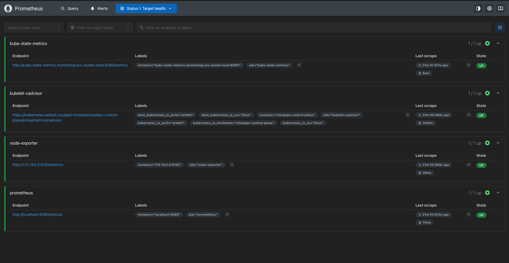
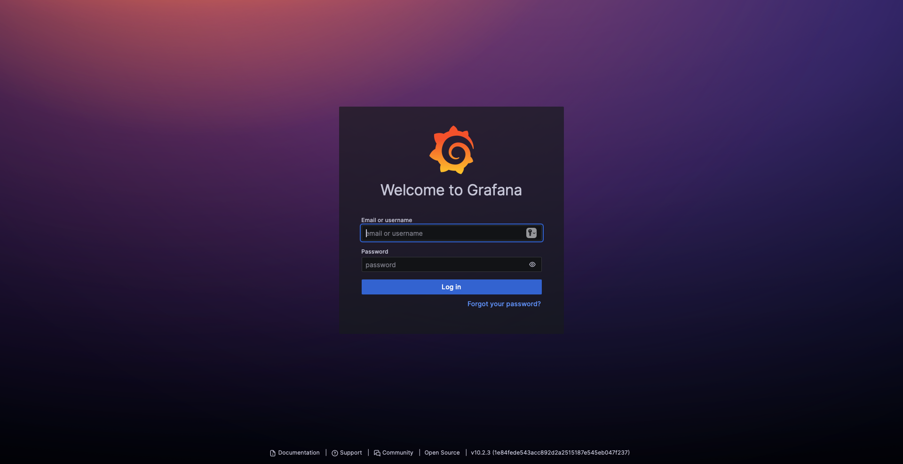
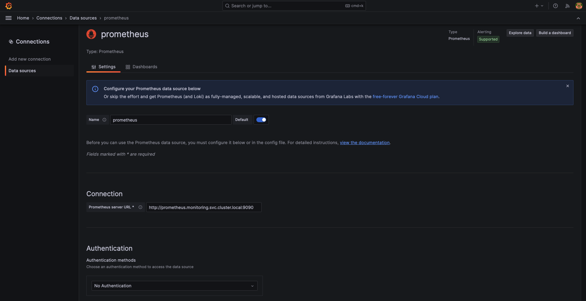
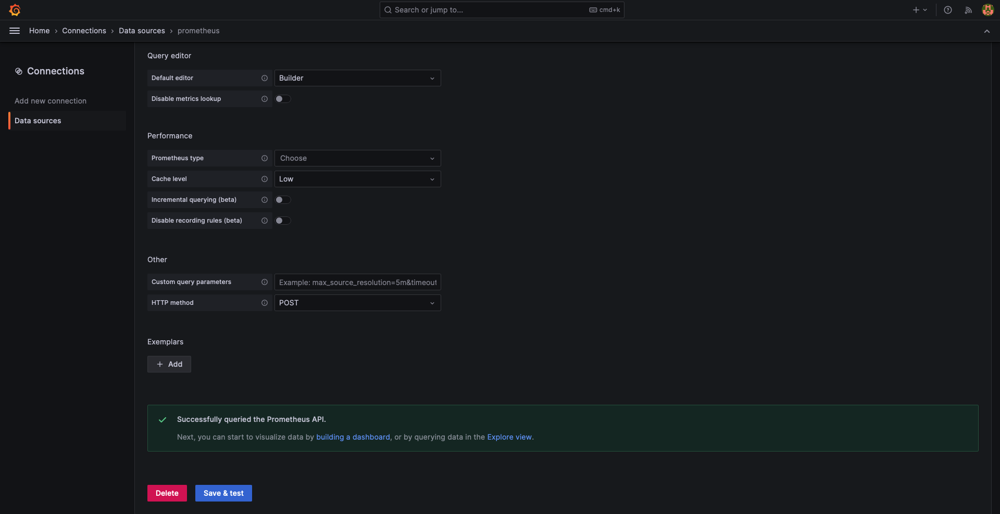
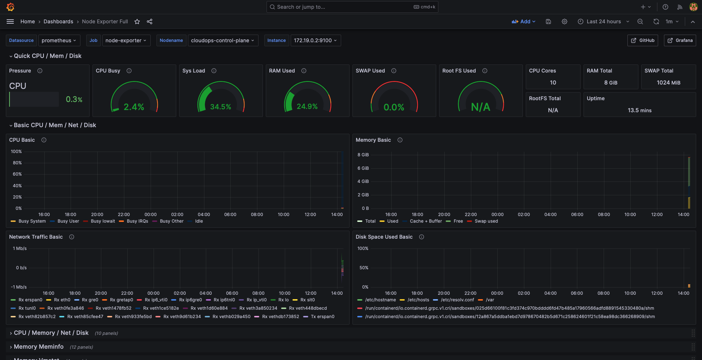
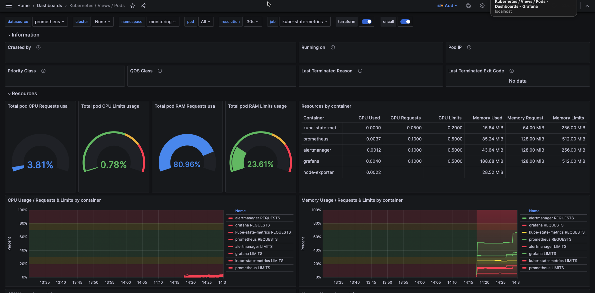
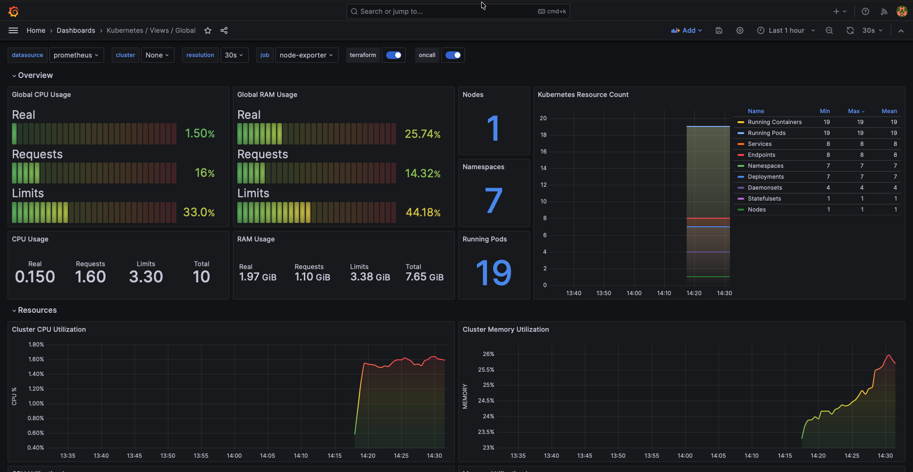
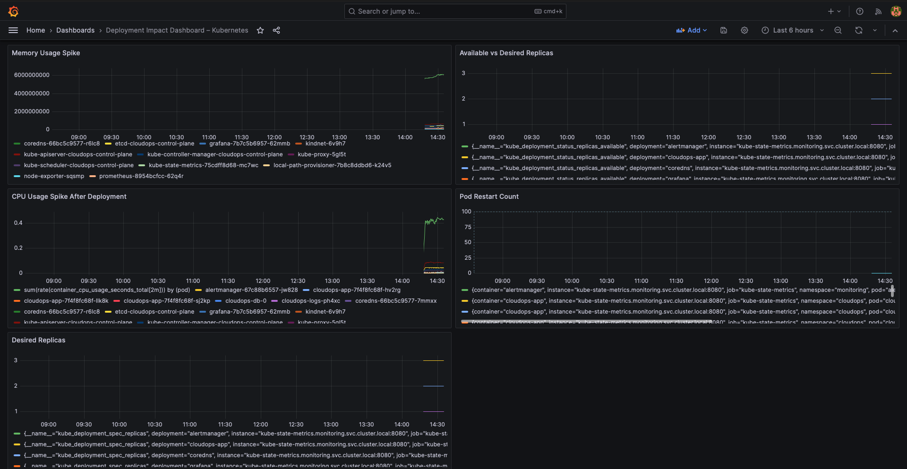

<!DOCTYPE html>
<html lang="en">
<head>
<meta charset="utf-8">
<meta name="viewport" content="width=device-width, initial-scale=1.0">
</head>
<body>

<h1>🟥 PHASE-5: Monitoring &amp; Observability (PHASE-5.md)</h1>

<strong>Version:</strong> Phase 5 
<strong>Module:</strong> Kubernetes Monitoring &amp; Observability 
<strong>Project:</strong> CloudOps Automation, CI/CD &amp; Monitoring System

<h2>📌 1. Overview</h2>

Phase-5 focuses on implementing <strong>production-style monitoring, metrics collection, visualization, and alerting</strong>
for Kubernetes workloads and applications deployed through the CI/CD pipeline.

This phase introduces a complete observability stack using <strong>Prometheus</strong> and <strong>Grafana</strong>,
deployed directly inside the <strong>KIND (Kubernetes IN Docker)</strong> cluster.

Monitoring ensures continuous visibility into:

<ul>
  <li>Kubernetes cluster health</li>
  <li>Pod and container resource utilization</li>
  <li>Application performance and availability</li>
  <li>Deployment stability after Jenkins-driven rollouts</li>
</ul>

<h2>🧩 2. Scope &amp; Architecture</h2>

The monitoring stack is deployed inside the existing KIND Kubernetes cluster and integrates seamlessly
with the CI/CD pipeline built in Phase-4.

<pre>
KIND Kubernetes Cluster
│
├── Prometheus
│   ├── Node Exporter
│   ├── cAdvisor
│   ├── kube-state-metrics
│   └── Application /metrics endpoint
│
├── Grafana
│   └── Dashboards (Cluster, Pods, Application, Deployments)
│
└── Alertmanager
    └── Alert Notifications
</pre>

This architecture enables real-time monitoring and alerting without relying on external cloud services.
CloudWatch and SNS integration is documented as a future extension for EKS migration.

<h2>📊 3. Monitoring Components</h2>

<h3>🔹 Metrics Collection (Prometheus)</h3>

Prometheus is deployed as a Kubernetes service and configured to scrape metrics from multiple sources:

<ul>
  <li><strong>Node Exporter</strong> – Node-level CPU, memory, disk, and network metrics</li>
  <li><strong>cAdvisor</strong> – Container-level CPU and memory usage</li>
  <li><strong>kube-state-metrics</strong> – Pod status, replicas, restarts, deployment health</li>
  <li><strong>Application Metrics Endpoint</strong> – HTTP requests, latency, error rates, uptime</li>
</ul>

<h2>📈 4. Visualization (Grafana)</h2>

Grafana is deployed inside Kubernetes and configured with Prometheus as the primary data source.

<h3>📊 Dashboards Implemented</h3>

<h4>1. Kubernetes Cluster Overview</h4>
<ul>
  <li>Node CPU &amp; memory utilization</li>
  <li>Pod distribution per node</li>
  <li>Overall cluster health indicators</li>
</ul>

<h4>2. Kubernetes Workloads Monitoring</h4>
<ul>
  <li>Pod CPU and memory usage</li>
  <li>Pod restart counts</li>
  <li>Replica availability vs desired state</li>
</ul>

<h4>3. Application Health Dashboard</h4>
<ul>
  <li>HTTP request rate</li>
  <li>Error rates (4xx / 5xx)</li>
  <li>Response latency</li>
  <li>Application uptime</li>
</ul>

<h4>4. Deployment Impact Dashboard</h4>
<ul>
  <li>Pod availability during rolling updates</li>
  <li>Resource usage spikes after deployments</li>
  <li>Error rate comparison before and after Jenkins deployments</li>
</ul>

<h2>🚨 5. Alerting</h2>

Prometheus alert rules are configured to detect anomalies and operational issues in real time.

<ul>
  <li>Pod down or unavailable</li>
  <li>High CPU usage (&gt; 80%)</li>
  <li>High memory consumption</li>
  <li>Frequent container restarts</li>
</ul>

Alerts are routed via <strong>Alertmanager</strong> to notification channels

<h2>🎯 6. Key Outcomes</h2>

<ul>
  <li>Real-time visibility into Kubernetes cluster health</li>
  <li>Continuous monitoring of application performance</li>
  <li>Validation of CI/CD deployment stability</li>
  <li>Early detection of failures and resource saturation</li>
  <li>Cloud-ready observability design aligned with AWS migration</li>
</ul>

<h2>🛠 7. Step-by-Step Implementation</h2>

<h3>🟥 STEP 1 – Create monitoring namespace</h3>

<h4>🎯 Objective</h4>

Create a dedicated Kubernetes namespace for all monitoring components (Prometheus, Grafana, Alertmanager, exporters).

<h4>Commands</h4>

<strong>1.1: Create monitoring namespace</strong>

<pre>
kubectl create namespace monitoring
</pre>

<strong>1.2: Verify namespace creation</strong>

<pre>
kubectl get namespaces
</pre>

<strong>Expected output:</strong>

<pre>
NAME              STATUS   AGE
default           Active   XXd
kube-system       Active   XXd
monitoring        Active   XXs
</pre>

<h3>🟥 STEP 2 – Deploy Prometheus manifests</h3>

<h4>🎯 Objective</h4>

Deploy Prometheus server with proper RBAC permissions to enable Kubernetes service discovery for metrics collection.

<strong>2.1: Create directory structure</strong>

<pre>
mkdir -p monitoring/prometheus
cd monitoring/prometheus
</pre>

<strong>2.2: Create Prometheus RBAC</strong>

📄 File: <code>monitoring/prometheus/prometheus-rbac.yaml</code>

This file contains ServiceAccount, ClusterRole, and ClusterRoleBinding for Prometheus.

<strong>2.3: Apply Prometheus RBAC</strong>

<pre>
kubectl apply -f monitoring/prometheus/prometheus-rbac.yaml
</pre>

<strong>2.4: Create Prometheus ConfigMap</strong>

📄 File: <code>monitoring/prometheus/prometheus-config.yaml</code>

<strong>2.5: Create Prometheus Deployment</strong>

📄 File: <code>monitoring/prometheus/prometheus-deployment.yaml</code>

<strong>Note:</strong> Ensure <code>serviceAccountName: prometheus</code> is added under <code>spec.template.spec</code>

<strong>2.6: Create Prometheus Service</strong>

📄 File: <code>monitoring/prometheus/prometheus-service.yaml</code>

<strong>2.7: Apply Prometheus manifests</strong>

<pre>
kubectl apply -f monitoring/prometheus/
</pre>

<strong>2.8: Verify Prometheus Deployment</strong>

<pre>
kubectl get pods -n monitoring
kubectl get svc -n monitoring
</pre>

<h3>🟥 STEP 3 – Verify Prometheus service</h3>

<h4>🎯 Objective</h4>

Confirm that Prometheus service is reachable, UI loads correctly, and Prometheus is scraping itself successfully.

<strong>3.1: Port-forward Prometheus service</strong>

<pre>
kubectl port-forward -n monitoring svc/prometheus 9090:9090
</pre>

<strong>3.2: Access Prometheus UI</strong>

Open browser: <code>http://localhost:9090</code>

<strong>3.3: Verify Prometheus Targets</strong>

In Prometheus UI: Click <strong>Status → Targets</strong>

Expected: Target <code>localhost:9090</code> shows Status: <strong>UP</strong> (green)

<strong>3.4: Quick Metrics Test</strong>

In Prometheus UI → Graph, run query: <code>up</code>

Expected result: Value = 1 for Prometheus target

<h3>🟥 STEP 4 – Deploy Node Exporter</h3>

<h4>🎯 Objective</h4>

Deploy Node Exporter to collect node-level metrics: CPU, memory, disk, and network I/O.

<strong>4.1: Create Node Exporter manifest</strong>

📄 File: <code>monitoring/node-exporter.yaml</code>

<strong>4.2: Apply Node Exporter</strong>

<pre>
kubectl apply -f monitoring/node-exporter.yaml
</pre>

<strong>4.3: Verify Node Exporter Pods</strong>

<pre>
kubectl get pods -n monitoring
</pre>

<h3>🟥 STEP 5 – Deploy kube-state-metrics</h3>

<h4>🎯 Objective</h4>

Deploy kube-state-metrics to collect Kubernetes object-level metrics: pod status, deployment health, replica counts, and restart counts.

<strong>6.1: Create kube-state-metrics manifest</strong>

📄 File: <code>monitoring/kube-state-metrics.yaml</code>

<strong>6.2: Apply kube-state-metrics</strong>

<pre>
kubectl apply -f monitoring/kube-state-metrics.yaml
</pre>

<strong>6.3: Verify kube-state-metrics Pod</strong>

<pre>
kubectl get pods -n monitoring
</pre>

<strong>Expected output:</strong>

<pre>
kube-state-metrics-xxxxx   1/1   Running
cadvisor-xxxxx             1/1   Running
node-exporter-xxxxx        1/1   Running
prometheus-xxxxx           1/1   Running
</pre>

<h3>🟥 STEP 6 – Verify Prometheus targets</h3>

<h4>🎯 Objective</h4>

Update Prometheus scrape configuration to collect metrics from all exporters deployed in previous steps.

<strong>7.1: Update Prometheus ConfigMap</strong>

📄 File: <code>monitoring/prometheus/prometheus-config.yaml</code>

Update the file to include scrape configs for Node Exporter, cAdvisor, and kube-state-metrics using Kubernetes service discovery.

<strong>7.2: Apply Updated ConfigMap</strong>

<pre>
kubectl apply -f monitoring/prometheus/prometheus-config.yaml
</pre>

<strong>7.3: Restart Prometheus</strong>

<pre>
kubectl rollout restart deployment prometheus -n monitoring
</pre>

<strong>7.4: Verify Prometheus Targets</strong>

Port-forward Prometheus service:

<pre>
kubectl port-forward -n monitoring svc/prometheus 9090:9090
</pre>

Open browser: <code>http://localhost:9090</code>

Navigate to: <strong>Status → Targets</strong>

<strong>Expected result:</strong>

<ul>
<li>prometheus → <strong>UP</strong> (green)</li>
<li>node-exporter → <strong>UP</strong> (green)</li>
<li>kube-state-metrics → <strong>UP</strong> (green)</li>
</ul>

<strong>7.5: Quick PromQL Tests (Optional)</strong>

In Prometheus UI → Graph, test these queries:

<pre>
up
node_cpu_seconds_total
container_cpu_usage_seconds_total
kube_pod_status_phase
</pre>

<strong>Expected:</strong> Data appears for all queries, confirming metrics collection is working.

<h3>🟥 STEP 7 – Deploy Grafana</h3>

<h4>🎯 Objective</h4>

Deploy Grafana inside the monitoring namespace for metrics visualization and dashboard creation.

<strong>8.1: Create Grafana Deployment</strong>

📄 File: <code>monitoring/grafana/grafana-deployment.yaml</code>

<strong>8.2: Create Grafana Service</strong>

📄 File: <code>monitoring/grafana/grafana-service.yaml</code>

<strong>8.3: Apply Grafana Manifests</strong>

<pre>
kubectl apply -f monitoring/grafana/
</pre>

<strong>8.4: Verify Grafana Deployment</strong>

<pre>
kubectl get pods -n monitoring
kubectl get svc -n monitoring
</pre>

<strong>Expected output:</strong>

<pre>
grafana-xxxxx   1/1   Running
grafana         NodePort   3000:32000/TCP
</pre>

<strong>8.5: Access Grafana UI</strong>

Due to KIND networking on macOS, use port-forward to access Grafana:

<pre>
kubectl port-forward -n monitoring svc/grafana 3000:3000
</pre>

Open browser: <code>http://localhost:3000</code>

<strong>Default Login:</strong>

<ul>
<li>Username: <code>admin</code></li>
<li>Password: <code>admin</code></li>
</ul>

<strong>Note:</strong> Change the password when prompted.

<h3>🟥 STEP 8 – Expose Grafana service</h3>

<h4>🎯 Objective</h4>

Connect Grafana to Prometheus to enable metrics querying and dashboard visualization.

<strong>9.1: Navigate to Data Sources</strong>

In Grafana UI:

<ol>
<li>Click ⚙️ <strong>Configuration</strong></li>
<li>Click <strong>Data sources</strong></li>
<li>Click <strong>Add data source</strong></li>
<li>Select <strong>Prometheus</strong></li>
</ol>

<strong>9.2: Configure Prometheus Data Source</strong>

<ul>
<li>Name: <code>Prometheus</code></li>
<li>URL: <code>http://prometheus.monitoring.svc.cluster.local:9090</code></li>
</ul>

<strong>9.3: Save & Test</strong>

Click <strong>Save & test</strong>

<strong>Expected message:</strong> "Data source is working"

<h3>🟥 STEP 9 – Add Prometheus datasource in Grafana</h3>

<h4>🎯 Objective</h4>

Import a pre-built Grafana dashboard to visualize Kubernetes cluster metrics including node CPU, memory, disk, and network usage.

<strong>10.1: Open Dashboard Import</strong>

In Grafana UI:

<ol>
<li>Click ➕ <strong>Create</strong></li>
<li>Click <strong>Import</strong></li>
</ol>

<strong>10.2: Import Dashboard by ID</strong>

Enter Dashboard ID: <code>1860</code>

Click <strong>Load</strong>

<strong>10.3: Configure Import</strong>

<ul>
<li>Name: <code>Node Exporter Full</code> (or keep default)</li>
<li>Data Source: Select <strong>Prometheus</strong></li>
</ul>

Click <strong>Import</strong>

<strong>10.4: Verify Dashboard</strong>

Dashboard should display live metrics for:

<ul>
<li>Node CPU usage</li>
<li>Node memory usage</li>
<li>Filesystem usage</li>
<li>Network I/O</li>
</ul>

<h3>🟥 STEP 10 – Import Cluster Overview dashboard</h3>

<h4>🎯 Objective</h4>

Visualize pod-level metrics including CPU, memory, network, and Kubernetes workload health.

<strong>11.1: Open Dashboard Import</strong>

In Grafana UI:

<ol>
<li>Click ➕ <strong>Create</strong></li>
<li>Click <strong>Import</strong></li>
</ol>

<strong>11.2: Import Dashboard by ID</strong>

Enter Dashboard ID: <code>15760</code>

Click <strong>Load</strong>

<strong>11.3: Configure Import</strong>

<ul>
<li>Name: <code>Kubernetes / Pods</code> (or keep default)</li>
<li>Data Source: Select <strong>Prometheus</strong></li>
</ul>

Click <strong>Import</strong>

<strong>11.4: Verify Dashboard</strong>

Dashboard filters:

<ul>
<li>Namespace: <code>monitoring</code></li>
<li>Pod: Select any pod or <code>All</code></li>
</ul>

<strong>Expected:</strong> Pod list visible, network metrics visible. Some resource panels may show limited data in infrastructure-only setups (this is normal).

<h3>🟥 STEP 11 – Import Workloads dashboard</h3>

<h4>🎯 Objective</h4>

Import additional Kubernetes workload monitoring dashboard for comprehensive pod and container visibility.

<strong>12.1: Open Dashboard Import</strong>

In Grafana UI:

<ol>
<li>Click ➕ <strong>Create</strong></li>
<li>Click <strong>Import</strong></li>
</ol>

<strong>12.2: Import Dashboard by ID</strong>

Enter Dashboard ID: <code>15757</code>

Click <strong>Load</strong>

<strong>12.3: Configure Import</strong>

<ul>
<li>Data Source: Select <strong>Prometheus</strong></li>
</ul>

Click <strong>Import</strong>

<strong>12.4: Verify Dashboard</strong>

Confirm workload metrics are visible.

<h3>🟥 STEP 12 – Create Application Health dashboard</h3>

<h4>🎯 Objective</h4>

Prepare a future-ready application health dashboard to monitor HTTP metrics, error rates, latency, and availability.

<strong>13.1: Create New Dashboard</strong>

In Grafana UI:

<ol>
<li>Go to <strong>Dashboards → New → New Dashboard</strong></li>
<li>Click <strong>Add a new panel</strong></li>
<li>Select Datasource: <strong>Prometheus</strong></li>
</ol>

<strong>13.2: Add Application Health Panels</strong>

<strong>Panel 1 – Application Availability</strong>

<pre>up</pre>

<strong>Panel 2 – HTTP Request Rate (Template)</strong>

<pre>sum(rate(http_requests_total[1m]))</pre>

<strong>Panel 3 – HTTP Error Rate (Template)</strong>

<pre>sum(rate(http_requests_total{status=~"5.."}[1m]))</pre>

<strong>Panel 4 – Application Latency (Template)</strong>

<pre>histogram_quantile(0.95, sum(rate(http_request_duration_seconds_bucket[5m])) by (le))</pre>

<strong>13.3: Save Dashboard</strong>

<ul>
<li>Name: <code>Application Health – Prometheus</code></li>
<li>Folder: <code>Monitoring</code></li>
</ul>

Click <strong>Save</strong>

<strong>Note:</strong> Panels may show "No data" until applications expose Prometheus metrics endpoints.

<h3>🟥 STEP 13 – Create Deployment Impact dashboard</h3>

<h4>🎯 Objective</h4>

Create a dashboard to visualize Kubernetes deployment behavior during rollouts, including pod availability, restarts, and resource usage.

<strong>14.1: Create New Dashboard</strong>

In Grafana UI:

<ol>
<li>Go to <strong>Dashboards → New → New Dashboard</strong></li>
<li>Click <strong>Add a new panel</strong></li>
<li>Datasource: <strong>Prometheus</strong></li>
</ol>

<strong>14.2: Add Deployment Impact Panels</strong>

<strong>Panel 1 – Available vs Desired Replicas</strong>

<pre>kube_deployment_status_replicas_available</pre>

<strong>Panel 2 – Desired Replicas</strong>

<pre>kube_deployment_spec_replicas</pre>

<strong>Panel 3 – Pod Restart Count</strong>

<pre>increase(kube_pod_container_status_restarts_total[5m])</pre>

<strong>Panel 4 – CPU Usage Spike After Deployment</strong>

<pre>sum(rate(container_cpu_usage_seconds_total[2m])) by (pod)</pre>

<strong>Panel 5 – Memory Usage Spike</strong>

<pre>sum(container_memory_usage_bytes) by (pod)</pre>

<strong>14.3: Save Dashboard</strong>

<ul>
<li>Name: <code>Deployment Impact – Kubernetes</code></li>
<li>Folder: <code>Monitoring</code></li>
<li>Time range: <code>Last 1 hour</code></li>
<li>Refresh: <code>10s</code></li>
</ul>

Click <strong>Save</strong>

<strong>Note:</strong> Panels populate with data during actual deployment rollouts from CI/CD pipeline.

<h3>🟥 STEP 14 – Configure Prometheus Alert Rules &amp; Grafana Persistence</h3>

<h4>🎯 Objective</h4>

Create Prometheus alert rules to automatically detect pod failures, high CPU usage, high memory usage, and container restarts. Also configure Grafana persistent storage to prevent data loss.

<h4>15.1: Create Alert Rules ConfigMap</h4>

📄 File: <code>monitoring/prometheus/alert-rules-configmap.yaml</code>

<strong>Note:</strong> Alert rules ConfigMap already configured in repository.

<strong>Apply:</strong>

<pre>
kubectl apply -f monitoring/prometheus/alert-rules-configmap.yaml
</pre>

<h4>15.2: Update Prometheus Deployment</h4>

📄 File: <code>monitoring/prometheus/prometheus-deployment.yaml</code>

<strong>Note:</strong> Deployment already configured with alert rules mount. Just apply and restart.

<pre>
kubectl apply -f monitoring/prometheus/prometheus-deployment.yaml
kubectl rollout restart deployment prometheus -n monitoring
</pre>

<h4>15.3: Verify Alert Rules Loaded</h4>

<strong>Check files inside Prometheus pod:</strong>

<pre>
kubectl exec -n monitoring deploy/prometheus -- ls /etc/prometheus
</pre>

<strong>Expected output:</strong>

<pre>
prometheus.yml
alert-rules.yaml
</pre>

<h4>15.4: Verify Alerts in Prometheus UI</h4>

<strong>Port-forward Prometheus:</strong>

<pre>
kubectl port-forward -n monitoring svc/prometheus 9090:9090
</pre>

Open browser: <code>http://localhost:9090</code>

<strong>Navigate to: Alerts tab</strong>

<strong>Expected alerts:</strong>

<ul>
  <li>✅ PodDown (Inactive/Pending)</li>
  <li>✅ HighCPUUsage (Inactive/Pending)</li>
  <li>✅ HighMemoryUsage (Inactive/Pending)</li>
  <li>✅ ContainerRestarting (Inactive/Pending)</li>
</ul>

<strong>Note:</strong> Status <strong>Inactive/Pending</strong> = ✅ <strong>CORRECT</strong>

<h3>🔧 GRAFANA PERSISTENT STORAGE CONFIGURATION</h3>

<h4>🔴 Issue: Grafana Data Loss on Restart</h4>

<strong>Problem:</strong>

<ul>
  <li>Grafana asks for username/password every time</li>
  <li>Password not working after restart</li>
  <li>All dashboards disappear</li>
</ul>

<h4>🔥 ROOT CAUSE</h4>

Grafana without persistent storage loses all data (users, passwords, dashboards) when pod restarts.

<strong>✅ This is expected behavior without PersistentVolumeClaim.</strong>

<h4>15.5: Create Grafana PVC</h4>

📄 File: <code>monitoring/grafana/grafana-pvc.yaml</code>

<strong>Note:</strong> PVC configuration already present in repository.

<strong>Apply:</strong>

<pre>
kubectl apply -f monitoring/grafana/grafana-pvc.yaml
</pre>

<h4>15.6: Update Grafana Deployment</h4>

📄 File: <code>monitoring/grafana/grafana-deployment.yaml</code>

<strong>Note:</strong> Deployment already configured with PVC mount. Just apply and restart.

<strong>Apply:</strong>

<pre>
kubectl apply -f monitoring/grafana/grafana-deployment.yaml
kubectl rollout restart deployment grafana -n monitoring
</pre>

<h4>15.7: Verify Grafana Persistence</h4>

<strong>Test the fix:</strong>

<ol>
  <li>Login to Grafana</li>
  <li>Set password once (e.g., <code>admin / srisuji0814</code>)</li>
  <li>Import any dashboard</li>
  <li>Restart the pod:
    <pre>kubectl delete pod -n monitoring -l app=grafana</pre>
  </li>
  <li>Open Grafana again</li>
</ol>

<strong>Expected result:</strong>

<ul>
  <li>✅ Password still works</li>
  <li>✅ Dashboards are still there</li>
  <li>✅ Datasources preserved</li>
</ul>

<h3>🟥 STEP 15 – Deploy Alertmanager</h3>

<h4>🎯 Objective</h4>

Deploy Alertmanager to receive alerts from Prometheus and manage notifications (Slack / Email integration added later).

<h4>🧩 Architecture</h4>

<h4>16.1: Create Alertmanager ConfigMap</h4>

📄 File: <code>monitoring/alertmanager/alertmanager-config.yaml</code>

<strong>Apply:</strong>

<pre>
kubectl apply -f monitoring/alertmanager/alertmanager-config.yaml
</pre>

<h4>16.2: Create Alertmanager Deployment</h4>

📄 File: <code>monitoring/alertmanager/alertmanager-deployment.yaml</code>

<strong>Apply:</strong>

<pre>
kubectl apply -f monitoring/alertmanager/alertmanager-deployment.yaml
</pre>

<h4>16.3: Create Alertmanager Service</h4>

📄 File: <code>monitoring/alertmanager/alertmanager-service.yaml</code>

<strong>Apply:</strong>

<pre>
kubectl apply -f monitoring/alertmanager/alertmanager-service.yaml
</pre>

<h4>16.4: Verify Alertmanager Pod</h4>

<pre>
kubectl get pods -n monitoring
</pre>

<strong>Expected output:</strong>

<pre>
alertmanager-xxxxx   1/1   Running
</pre>

<h4>16.5: Access Alertmanager UI</h4>

<strong>⚠️ Important Note for KIND Users:</strong>

In KIND (Kubernetes IN Docker), NodePort does <strong>NOT</strong> automatically bind to localhost. Ports are exposed inside the Docker node, not directly on your Mac.

<strong>❌ This will NOT work:</strong>

<pre>
http://localhost:30903
</pre>

<strong>✅ Correct approach - Use port-forward:</strong>

<pre>
kubectl port-forward -n monitoring deploy/alertmanager 9093:9093
</pre>

Open browser: <code>http://localhost:9093</code>

<strong>Expected result:</strong>

<ul>
  <li>✅ Alertmanager UI opens</li>
  <li>✅ Status page visible</li>
  <li>✅ No alerts firing (for now - this is correct)</li>
</ul>

<h4>16.6: Connect Prometheus to Alertmanager</h4>

<strong>⚠️ VERY IMPORTANT:</strong> Update Prometheus configuration to send alerts to Alertmanager.

<strong>Apply updated configuration:</strong>

<pre>
kubectl rollout restart deployment prometheus -n monitoring
</pre>

<h4>16.7: Verify Prometheus-Alertmanager Connection</h4>

<strong>Port-forward Prometheus:</strong>

<pre>
kubectl port-forward -n monitoring svc/prometheus 9090:9090
</pre>

Open browser: <code>http://localhost:9090</code>

<strong>Navigate to: Status → Alertmanagers</strong>

<strong>Expected result:</strong>

<pre>
alertmanager.monitoring.svc.cluster.local:9093   ✔️ UP
</pre>

<h2>📌 Step 16 Completion Checklist</h2>

<table border="1" cellpadding="8" cellspacing="0">
  <thead>
    <tr>
      <th>Task</th>
      <th>Status</th>
    </tr>
  </thead>
  <tbody>
    <tr>
      <td>Alertmanager ConfigMap created</td>
      <td>✅</td>
    </tr>
    <tr>
      <td>Alertmanager Deployment created</td>
      <td>✅</td>
    </tr>
    <tr>
      <td>Alertmanager Service created</td>
      <td>✅</td>
    </tr>
    <tr>
      <td>Alertmanager pod running</td>
      <td>✅</td>
    </tr>
    <tr>
      <td>Alertmanager UI accessible via port-forward</td>
      <td>✅</td>
    </tr>
    <tr>
      <td>Prometheus connected to Alertmanager</td>
      <td>✅</td>
    </tr>
    <tr>
      <td>Connection verified in Prometheus UI</td>
      <td>✅</td>
    </tr>
  </tbody>
</table>

<h3>🟥 STEP 16 – Test Alerts (CPU / Pod Down)</h3>

<h4>🎯 Objective</h4>

Intentionally trigger alerts and verify they appear in both Prometheus and Alertmanager.

<h4>17.1 Verify Alert Rules Loaded (Prometheus)</h4>
<ol>
  <li>Port-forward Prometheus:
    <pre>kubectl port-forward svc/prometheus 9090:9090 -n monitoring</pre>
  </li>
  <li>Open: <code>http://localhost:9090</code></li>
  <li>Go to: <strong>Status → Rules</strong></li>
</ol>

<strong>Expected:</strong> Alert rules such as <code>PodDown</code>, <code>HighCPUUsage</code>,
<code>HighMemoryUsage</code>, <code>ContainerRestarting</code> should appear as
<strong>Inactive (green)</strong>.

<h4>🔴 1️⃣ Test: CloudOpsDeploymentUnavailable</h4>

<strong>Trigger:</strong>

<pre>
kubectl scale deployment cloudops-app -n cloudops --replicas=0
</pre>

<strong>Expected:</strong>

<ul>
  <li><code>CloudOpsDeploymentUnavailable</code> → <strong>FIRING</strong></li>
</ul>

<strong>Restore:</strong>

<pre>
kubectl scale deployment cloudops-app -n cloudops --replicas=3
</pre>

<h4>🔴 2️⃣ Test: CloudOpsImagePullFailure</h4>

<pre>
kubectl set image deployment/cloudops-app -n cloudops cloudops-app=nginx:doesnotexist
</pre>

<strong>Expected:</strong>

<ul>
  <li>Pods enter <code>ErrImagePull</code> / <code>ImagePullBackOff</code></li>
  <li><code>CloudOpsImagePullFailure</code> → <strong>FIRING</strong></li>
</ul>

<strong>Restore:</strong>

<pre>
kubectl rollout undo deployment/cloudops-app -n cloudops
</pre>

<h4>🟠 3️⃣ Test: HighCPUUsage</h4>

<strong>Create CPU stress pod:</strong>

<pre>
kubectl run cpu-test \
--image=busybox \
-n cloudops \
--restart=Never \
-- sh -c "while true; do :; done"
</pre>

<strong>Verify in Prometheus:</strong>

<pre>
topk(5,
  sum by (namespace, pod) (
    rate(container_cpu_usage_seconds_total{namespace="cloudops"}[2m])
  )
)
</pre>

<strong>Cleanup:</strong>

<pre>
kubectl delete pod cpu-test -n cloudops
</pre>

<h4>🟠 4️⃣ Test: HighMemoryUsage</h4>

<strong>Create memory hog pod:</strong>

<pre>
kubectl run mem-test \
--image=busybox \
-n cloudops \
--restart=Never \
-- sh -c "x=; while true; do x=$x$(head -c 5M &lt;/dev/zero); sleep 1; done"
</pre>

<strong>Verify in Prometheus:</strong>

<pre>
topk(5,
  sum by (namespace, pod) (
    container_memory_working_set_bytes{namespace="cloudops"}
  )
)
</pre>

<strong>Expected:</strong>

<ul>
  <li><code>mem-test</code> exceeds 500MB memory</li>
  <li><code>HighMemoryUsage</code> → <strong>FIRING</strong></li>
</ul>

<strong>Cleanup:</strong>

<pre>
kubectl delete pod mem-test -n cloudops
</pre>

<h4>🟠 5️⃣ Test: ContainerRestarting</h4>

<pre>
kubectl run crash-test \
--image=busybox \
-n cloudops \
--restart=Always \
-- sh -c "exit 1"
</pre>

<strong>Expected:</strong>

<ul>
  <li>Pod restarts continuously</li>
  <li><code>ContainerRestarting</code> → <strong>FIRING</strong></li>
</ul>

<strong>Cleanup:</strong>

<pre>
kubectl delete pod crash-test -n cloudops
</pre>

<h4>✅ Verification</h4>

<ul>
  <li><strong>Prometheus:</strong> <code>http://localhost:9090 → Alerts</code></li>
  <li><strong>Alertmanager:</strong>
    <pre>kubectl port-forward svc/alertmanager 9093 -n monitoring</pre>
    <code>http://localhost:9093</code>
  </li>
</ul>

<h4>🧠 Alert Test Summary</h4>

<table border="1" cellpadding="8" cellspacing="0">
  <tr>
    <th>Alert</th>
    <th>Trigger</th>
  </tr>
  <tr>
    <td>CloudOpsDeploymentUnavailable</td>
    <td>Scale replicas to zero</td>
  </tr>
  <tr>
    <td>CloudOpsImagePullFailure</td>
    <td>Invalid image</td>
  </tr>
  <tr>
    <td>HighCPUUsage</td>
    <td>Busy loop pod</td>
  </tr>
  <tr>
    <td>HighMemoryUsage</td>
    <td>Memory hog pod</td>
  </tr>
  <tr>
    <td>ContainerRestarting</td>
    <td>Crash-loop pod</td>
  </tr>
</table>

<h2>✅ PHASE-5 COMPLETE</h2>

</body>
</html>